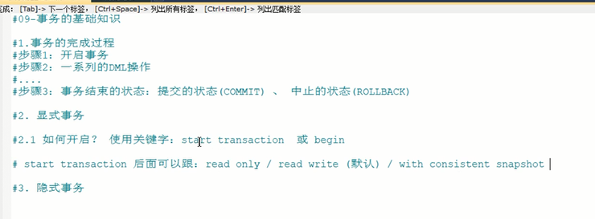

MySQL中 只有innoDB支持事务

原子性 atomicity

一致性 consistency

隔离性 isolation

持久性 durability

事务的状态
---

活动的

部分提交的

失败的

中止的

提交的

显式事务和隐式事务
---

begin 和 start transaction read only/read write/ with consistent snapshot

