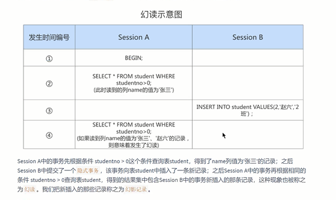

MySQL中 只有innoDB支持事务

原子性 atomicity

一致性 consistency

隔离性 isolation

持久性 durability

事务的状态
---

活动的

部分提交的

失败的

中止的

提交的

显式事务和隐式事务
---

begin 和 start transaction read only/read write/ with consistent snapshot

read only 可以增删改 临时表 临时表只在当前会话

save point （保存点）

关闭自动提交
---

隐式提交数据的情况
---

脏写 dirty write
---

脏读 dirty read
---

不可重复读 non repeatable read
---

幻读 phantom
---

SQL中的隔离级别
---

可重复读 是MySQL的默认隔离级别 避免 脏读，不可从幅度，但幻读避免不了。

任何级别都不允许脏写

