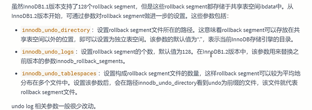

redo 和 undo 都是存储引擎层（InnoDB）生成的日志

redo 针对的是物理层面上的页数据，修改页号，偏移量，写入数据

undo 针对逻辑层面，例如对insert的逆操作，如delete 主要用于 `事务的回滚` 和 `一致性非锁定读`

原子性 一致性 持久性 都有redo 和 undo 保证 而 隔离性由 MySQL锁保证

redo日志（重做日志）
---

内存中修改完数据（buffer pool） 按一定频率刷盘 存储到磁盘（check point） 进行物理上的持久化

MySQL的innoDB的处理方案是 先写日志 再按日志的产生顺序 写入磁盘

redo的组成
---

表空间号+数据页号+偏移量+修改数据长度+具体修改的数据

redo log buffer 在内存的 16M

redo log file 在硬盘的

redo log 的刷盘策略
---

redo log buffer -> page cache （交给操作系统处理） -> redo log file

redo log 的刷盘过程

Undo日志 （回滚日志）
---

Undo日志的作用
---

回滚数据和实现MVCC

Undo的结构
---

每个事务都能用一个回滚段，一个回滚段同时服务多个事务，回滚段(rollback segment)

Undo的重用
---
    

回滚段和事务
---

inset undo log和 update undo log
---
    

只有buffer pool的流程 和 有 redo log 和undo log的情况
---

详细生成过程
---

undo log是如何回滚的和删除的
---

小结
---

