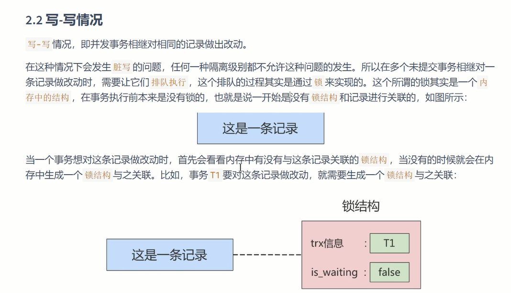
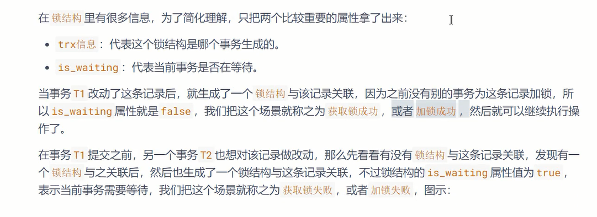
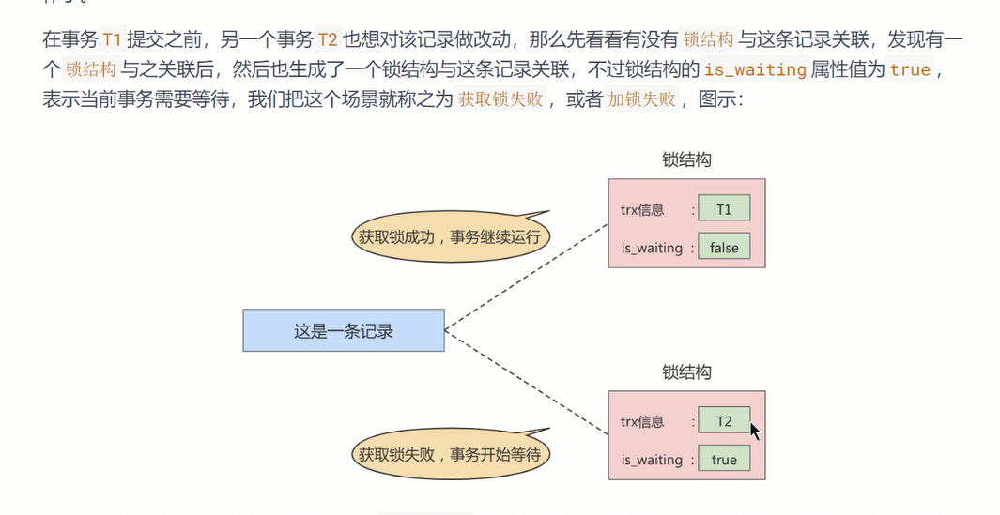
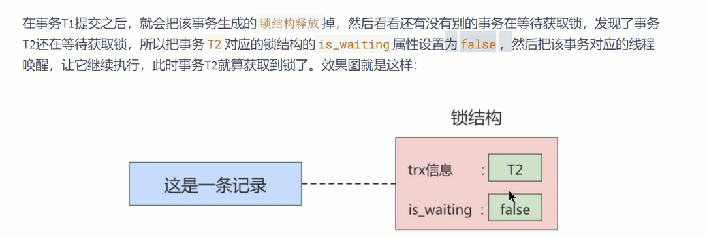
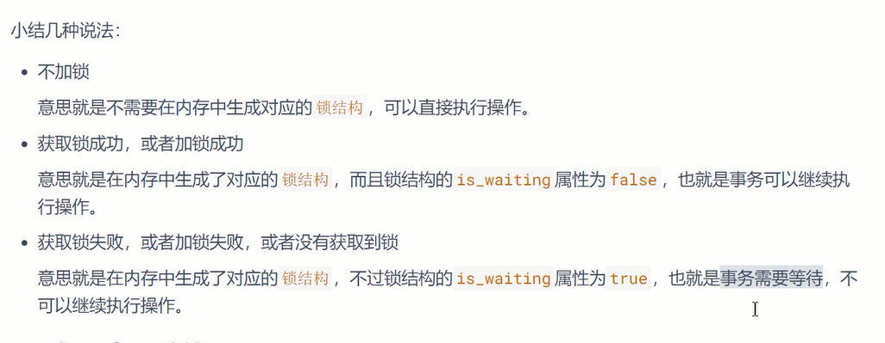
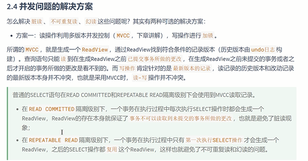
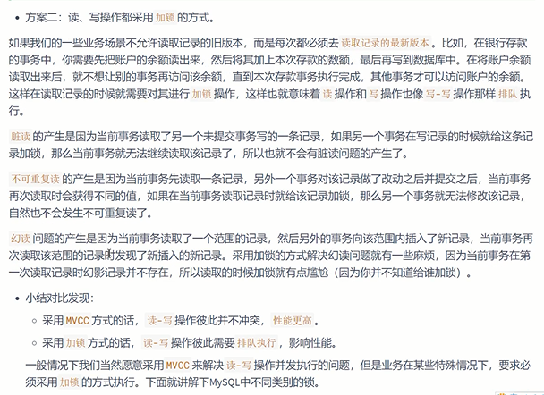

写-写
---

有几个事务对同一个记录做改动 就有多少个锁结构 一个事务一个锁结构

简单说 锁结构中 

1 要存放事务的信息  trx信息

2 要存放 当前事务是否在等待 is_waiting, false 获取锁， True 未获取锁

读-写， 写-读
---

脏读，不可重复读，幻读

方案一 由MVCC 生成一个read view 历史版本 （undo log）(已提交的事务)

读的的读到`read view`的版本 而写是`对最新版本的记录`

方案二 读和写都加锁

