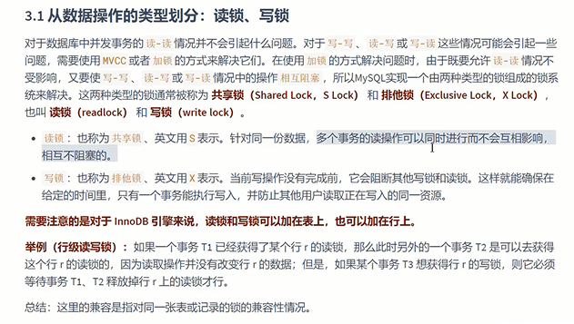
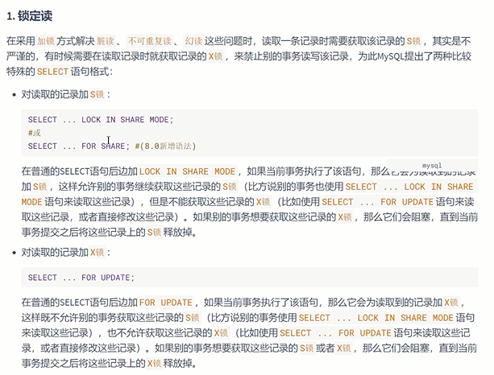
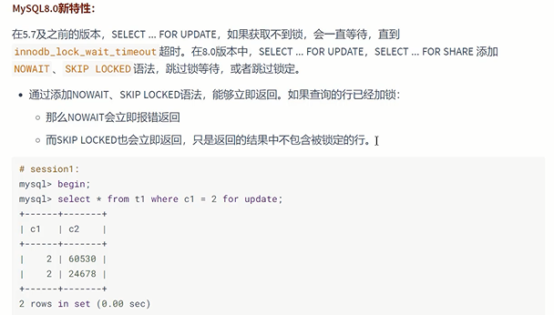
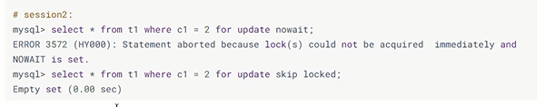

从数据操作的类型划分：读锁 写锁
---

共享锁 shared lock 可以叫 读锁 read lock

排他锁 exclusive lock  也可以叫 写锁 write lock

对于innoDB说 读锁和写锁 可以放在表上 也可以放在行上

    读锁和读锁不互斥， 但是后加写锁和读锁互斥

    先加写锁，再加读锁也是互斥的

    写锁和写锁也互斥

select ... for share 读加读锁

select ... for update 读加写锁

加锁情况 报错返回
---

