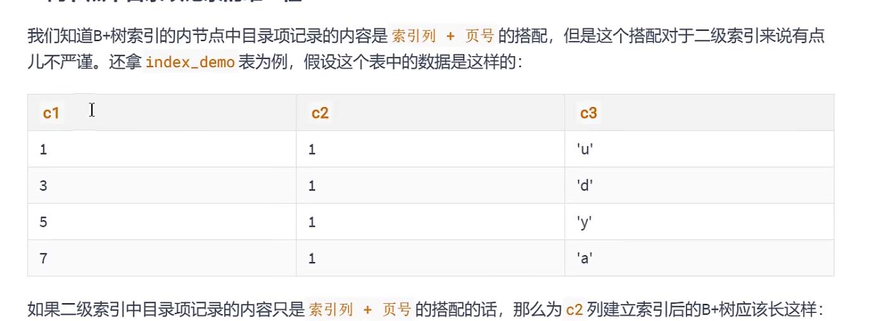
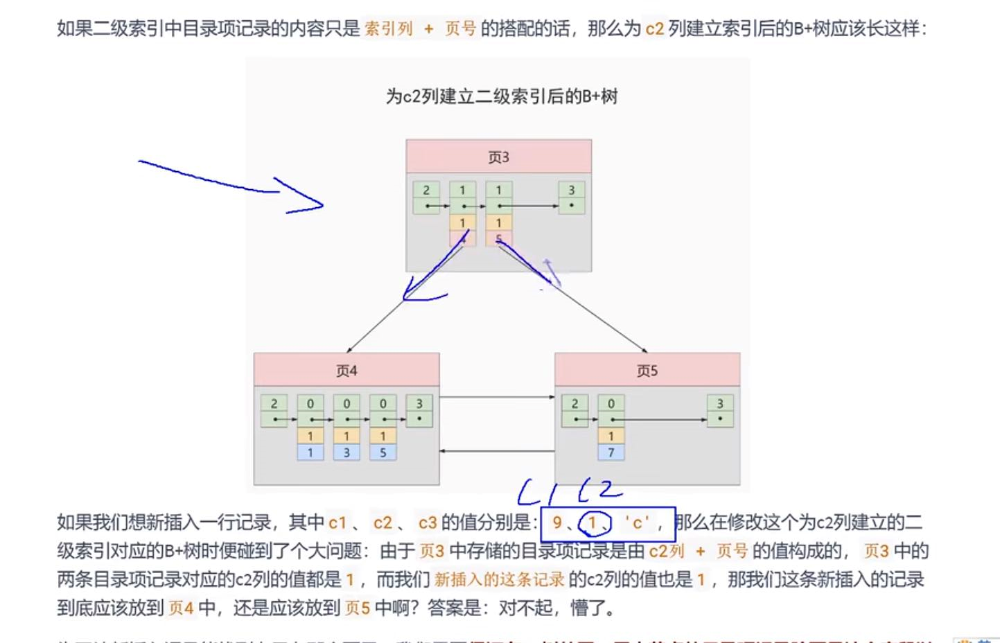
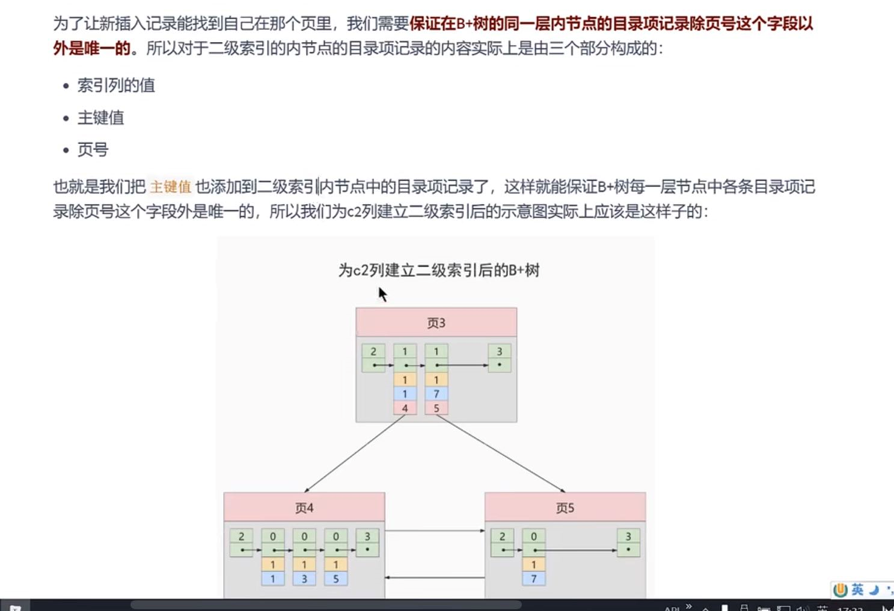
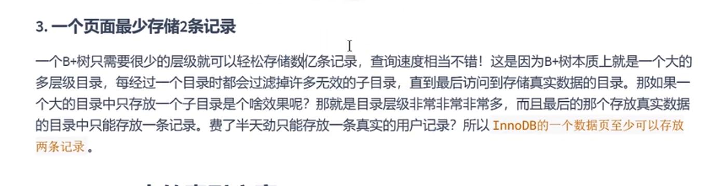

根页面（根节点）位置万年不动
---

创建表后，首先创建根节点，此时的根节点是（用户记录页），如果用户记录页超过16k

将用户记录页中的内容 复制出来一个新的叶子节点（用户记录页）

原本的根节点，此时变为目录页。

如果此次的目录页超过16k，会再次复制出一个非叶子节点（目录页）

此时的根节点，变为目录管理页。

内节点中的目录项记录的唯一性（二级索引 也会保存主键值）
---

二级索引中 目录页中 由C2列和 页号组成， 如果C2列相同，都为1，插入的数据也为1，（C1=9,C2=1）

那么 叶子节点如果最小都为1，就分不清 该插入哪页了。

所以要把主键值页添加到二级索引的 内节点的 目录页中

也就是目录页 存放了 列名的最小值， 主键值，还有页号

一个页面最少存储2条数据(起码是二叉树)
---

