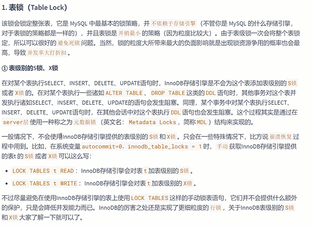
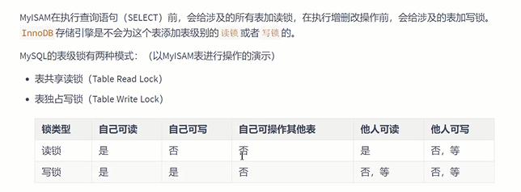
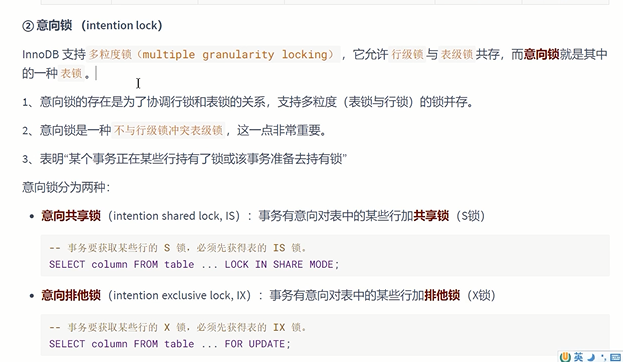

表锁 table lock
---

    lock tables 表名 read;

    lock tables 表名 write;

    unlock tables; 解锁

表锁不依赖存储引擎  innoDB支持 行锁 和表锁  myISAM只支持表锁

在表上加读锁 自己可读，他人也可读，但是自己不能写，他人也不能写。不能操作其他表

在表上加写锁 自己可读，他人不可读，自己可写， 他人不能写。不能操作其他表

意向锁 intention( yin ten xin) lock
---

协调行锁 和 写锁 节省计算时间的方式

多粒度锁 行锁和表锁共存

意向锁 是 一种 `不和行级锁冲突的表级锁`

意向锁由存储引擎来维护 

如果一个事务给表中某一行加了一个排它锁 会同时给表或者页 加一个意向锁 

如果有其他事务给该表或者页加排它锁 就会阻塞

意向锁会告诉其他事务已经有事务锁定了某行记录

意向共享锁 和意向排它锁 是兼容的 

意向共享锁和共享锁是兼容的

意向共享锁和排它锁是不兼容的

意向拍它锁和共享锁是不兼容的

意向拍它锁和排它锁是不兼容的

