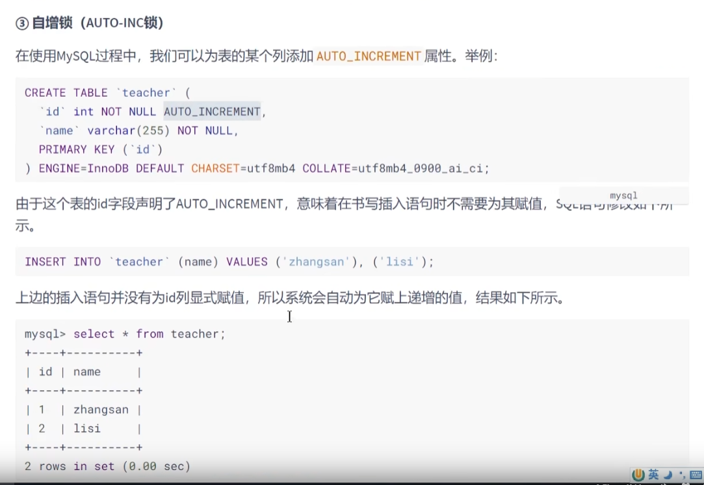
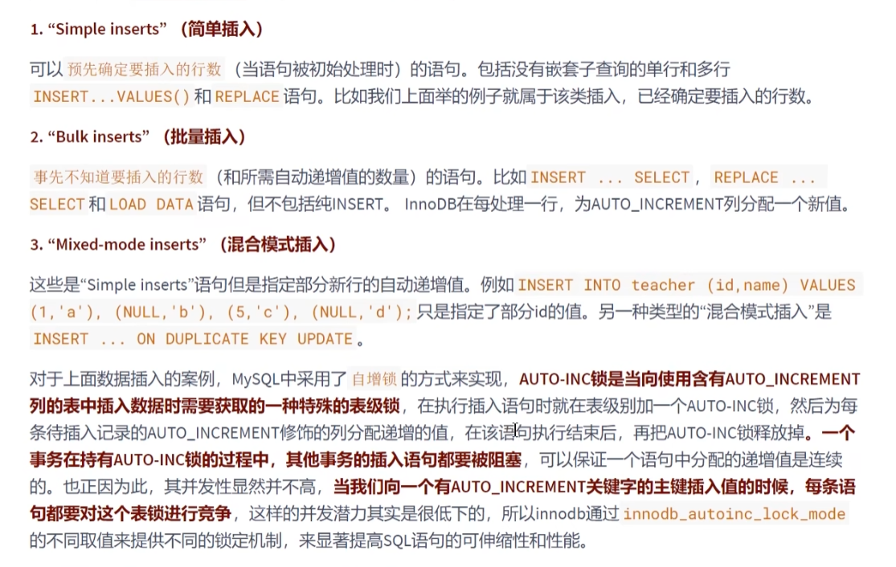
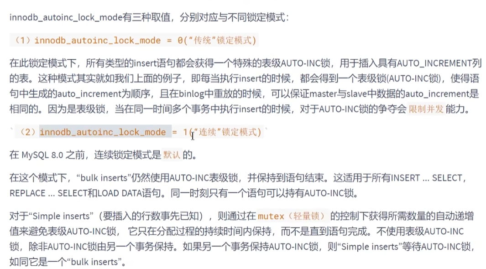
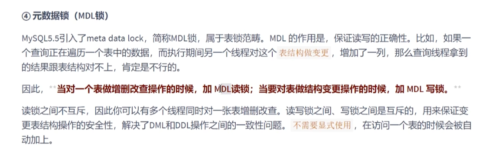

自增锁（auto-increment锁）
---

多个事务同时插入数据时，要保证Id是unique的

插入数据分为 

simple insert

bulk(bao ke)(主体; 大部分; (大)体积; 大(量); 巨大的体重(或重量、形状、身体等);  insert

mixed(mei ke si de)(混合的; 混杂的; 人员混杂的; 由不同种族的人组成的; 掺杂在一起的; 男女混杂的;)-mode insert;

innodb_autoinc_lock_mode = 0;(传统模式 表级锁)

innodb_autoinc_lock_mode = 1;(通过轻量锁，对simple insert这种避免锁表，但是bulk insert仍是表锁)

innodb_autoinc_lock_mode = 2;（MySQL 8.0开始 默认是混合模式，保证了 唯一且单调递增，但不一定是连续的）

元素据锁（meta data lock）

增删改查会对表加mdl读锁，修改表结构会对表 加mdl写锁

读锁和读锁不互斥，读锁和写锁，写锁和写锁互斥。

