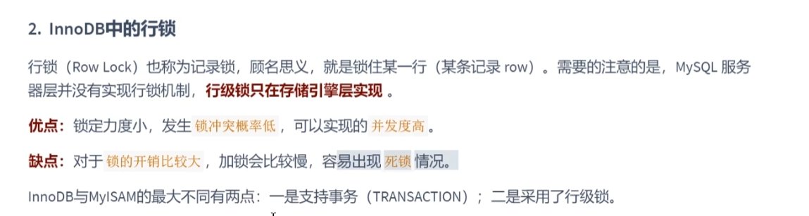
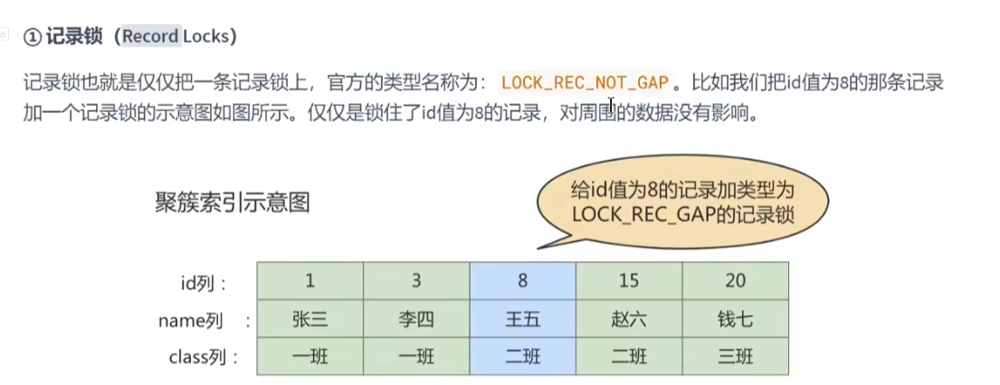
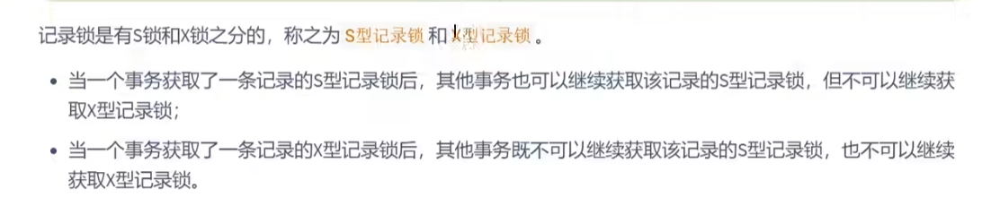
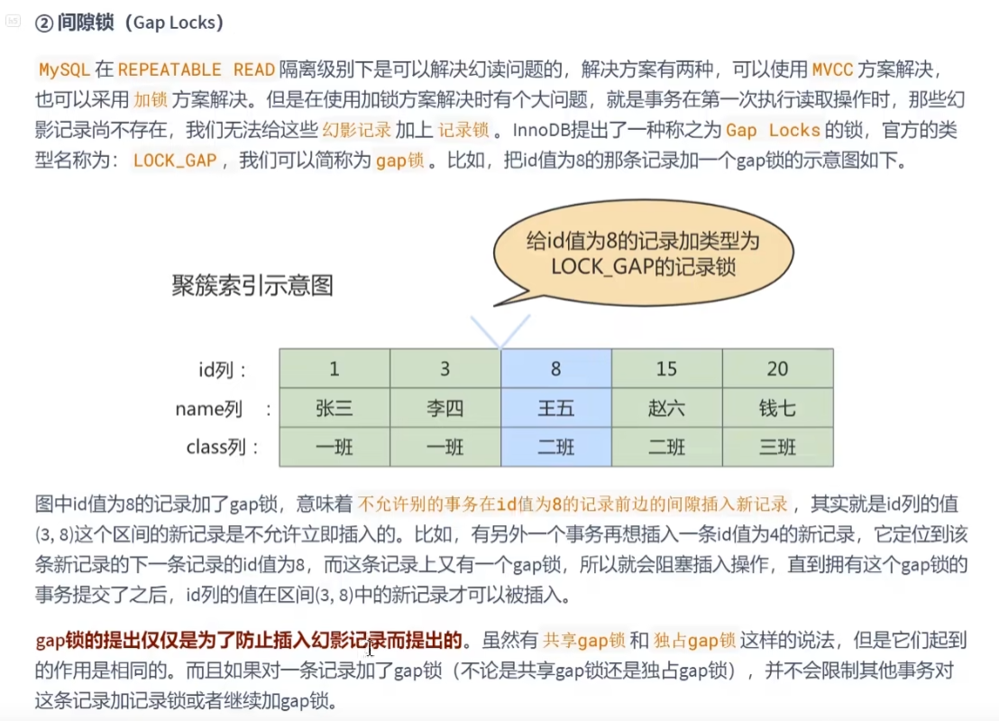
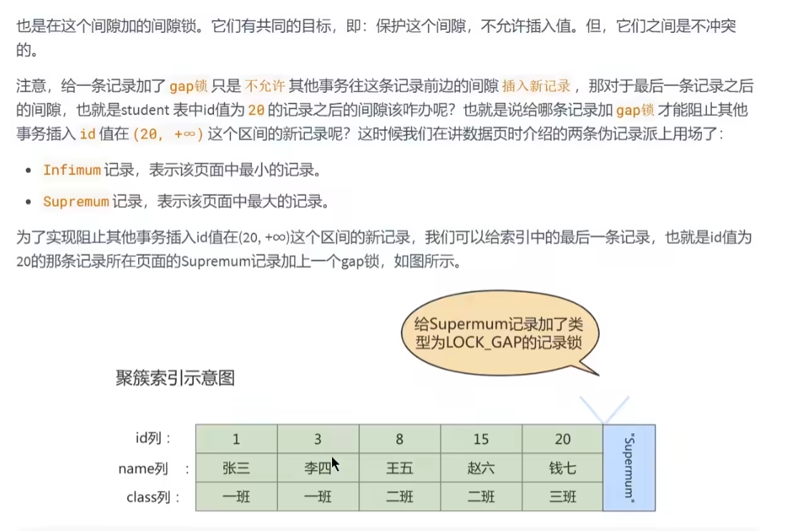

innoDB的行锁
---

记录锁 record lock
---

lock record not gap（gai pu）(缺口; 差距; 间隙; 间隔; 开口; 豁口; 裂口; 间断; 分歧; 隔阂)

record lock 分共享记录锁，和排它记录锁

读读不互诉，读写 和 写写互斥

间隙锁 gap lock
---

间隙锁 解决 repeatable read下的幻读问题

记录锁 无法解决 `幻读` 的问题 针对插入数据使用了 gap lock 

比如 给id为8的记录上加一个gap lock 那么别的事务在 3-8之间插入数据，

就会阻塞， 一直到这个gap lock持有锁的事务提交后，别的事务才能插入数据。

如果 表中最大记录是20 select ... where id =  25，那么锁的是 20 到 supermum（上确界）

infimum

