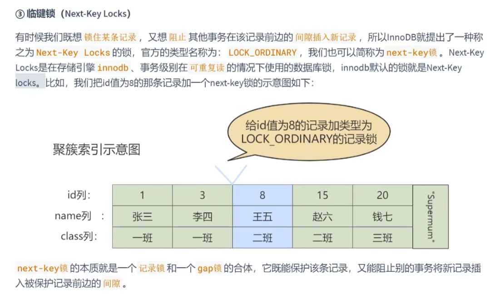
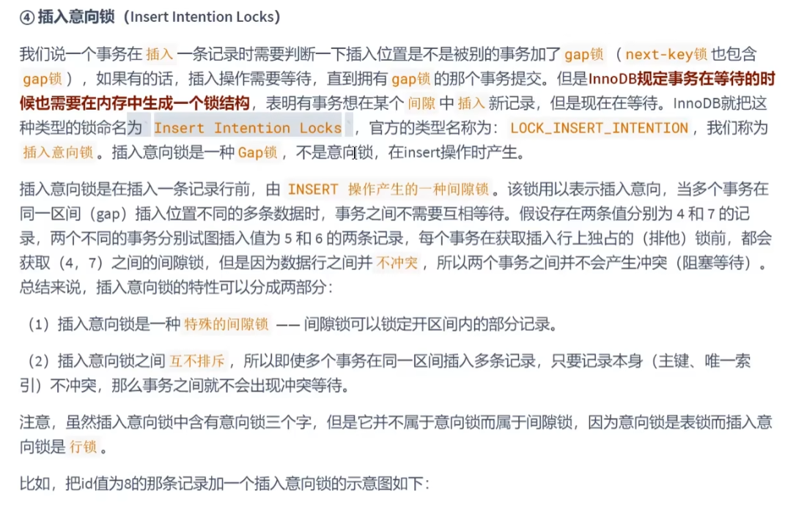
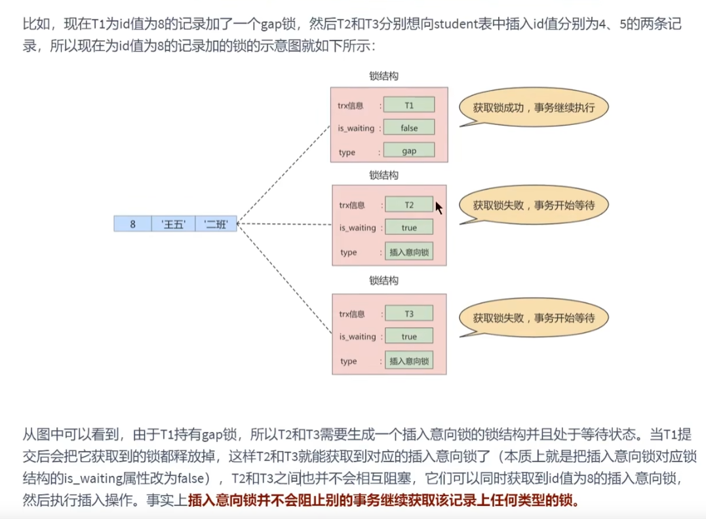

临键锁 next key lock
---

以要锁的记录作为右闭区间，又能锁记录左边的开区间

就是记录锁record lock 和 间隙锁gap lock的结合。

在innoDB,事务级别在 repeatable（rui pi tai bo）read 可重复读情况下使用是行锁

innoDB默认的行锁就是 next key lock

插入意向锁 insert intention
---

插入意向锁 属于 间隙锁  而不是意向锁  意向锁是表锁不是行锁

在插入insert时产生

