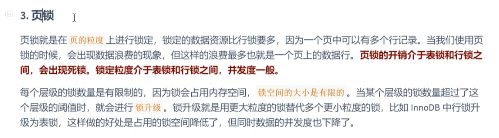
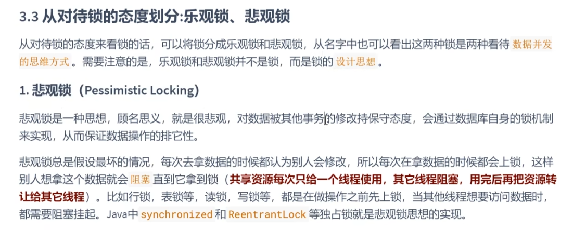
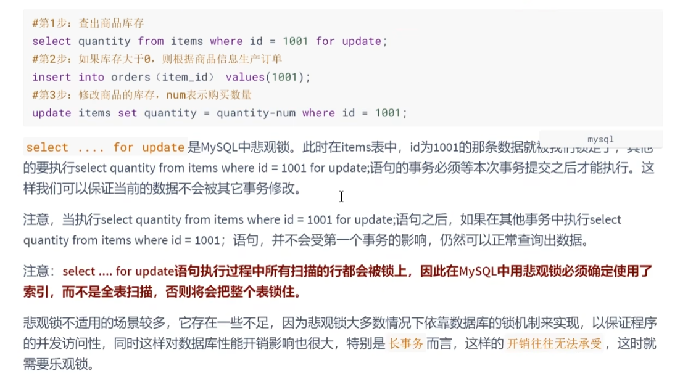
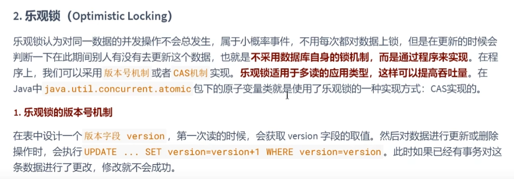
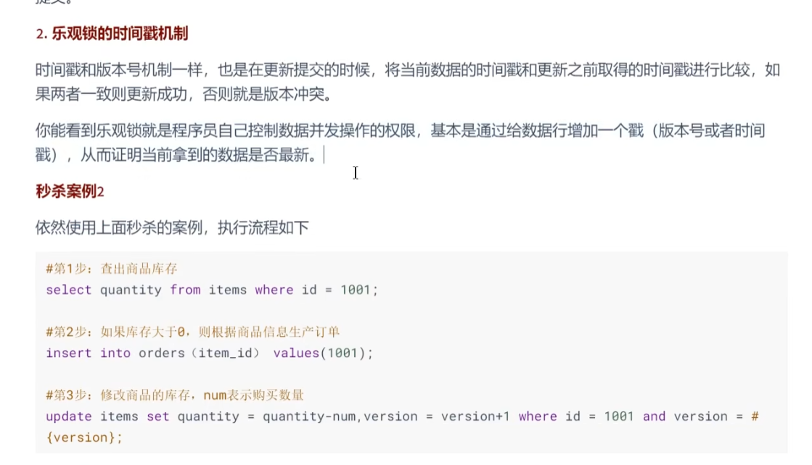
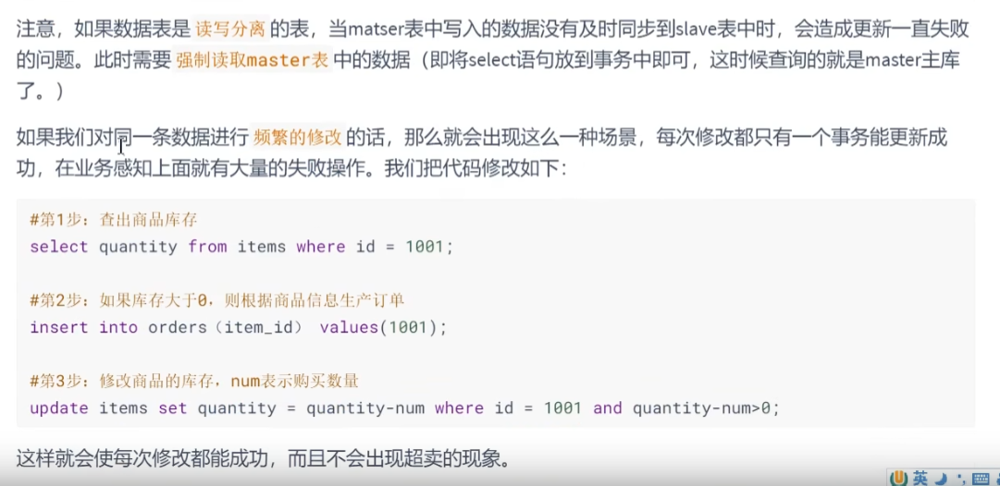
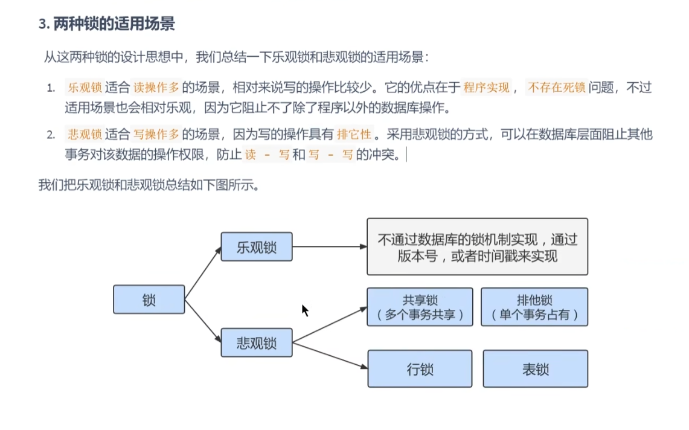

页锁
---

粒度在表锁和行锁之间 会出现死锁

锁升级的话 会用更大粒度的锁替代更小粒度的锁

悲观锁
---
使用悲观锁 一定要保证 确定使用了索引， 否则会把整个表锁住

乐观锁
---

可以用版本号和时间戳的方式

也可以用 update 表 set num = num - 1 where id = {id} and num - 1 > 0;

读写分离情况， 对业务的修改一定要请求master，而不是slave

两种锁的适用场景
---

