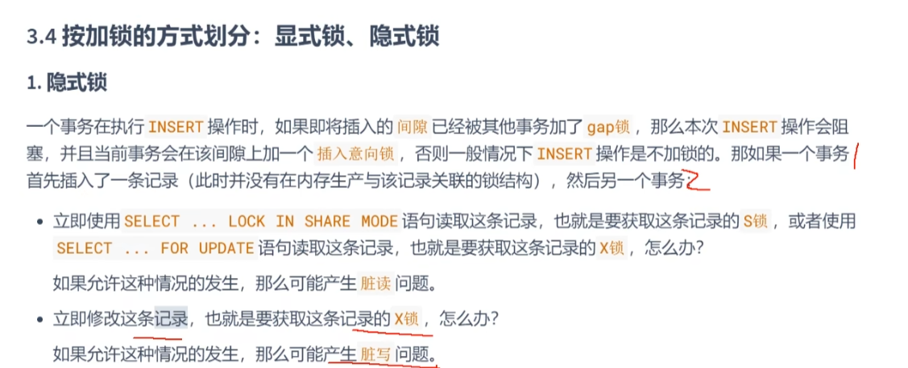
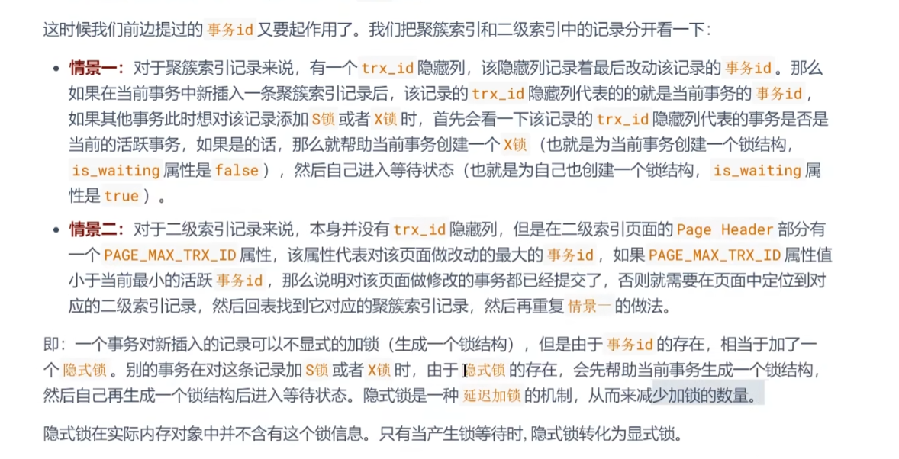
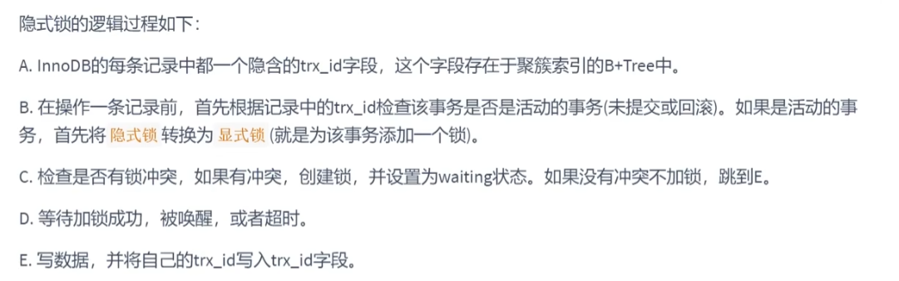
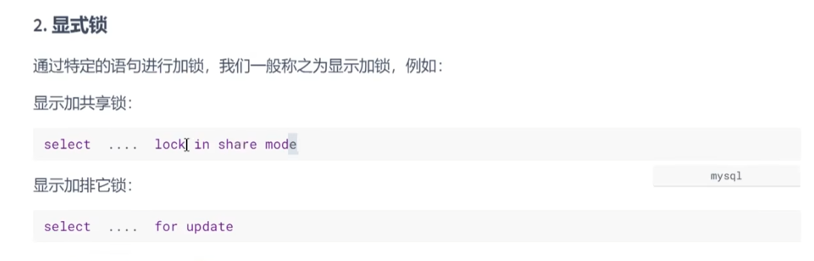

隐式锁
---

一般新插入的记录的操作不加锁

防止当前事务插入数据时，数据未提交，被其他事务访问到。

行记录上有隐藏的事务ID，判断当前事务和记录上的事务ID（trx_id）是否相同

若别的事务访问到了 给当前事务加一个 锁结构  自己再加个锁结构 并进入等待状态 

隐式锁是一种 延迟加锁 的机制， 为了是减少加锁的开销

当有别的事务访问时，才有隐式锁， 所以是一种 延迟加锁

隐式锁的加锁过程：
---

显示锁
---

显示锁 就是 lock in share mode（共享锁） 和 for update（排它锁）

