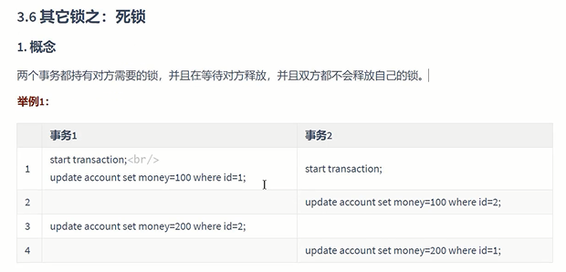
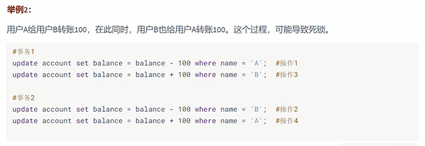
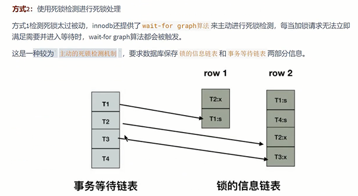

全局锁
---
让整个库处于只能读不能写的情况， 一般是做全库逻辑备份使用

死锁
---

两个事务都持有各自的锁，且都在等待对方释放锁，

死锁产生条件
---

死锁处理方法
---

方式1 等待超时 innodb_lock_wait_timeout=50s

修改等待超时时间 超时了就回滚 

简单处理方式就是把时间改短点 但这种方式容易误伤到普通的锁

方式2 使用死锁检测进行死锁处理 innodb_deadlock_detect（di tai ke t 发现; 查明; 侦察出）=on来开启

类似链表的结构 判断是否由环 如果有环 则存在死锁

回滚undo量最小的事务（回滚成本最低的事务）

但缺点是成本很高

如何解决死锁
---

控制并发数量 在中间件层实现 进入sql前排队

检查代码逻辑 避免 update/delete的事务长时间执行

显式加锁 必须使用索引查找数据，不要锁定全表

