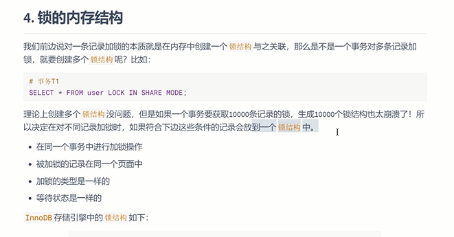
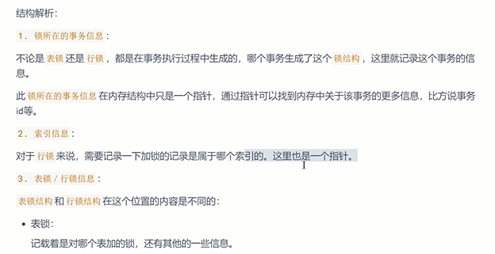
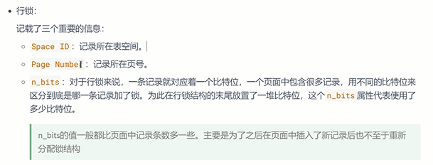
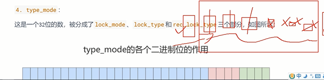
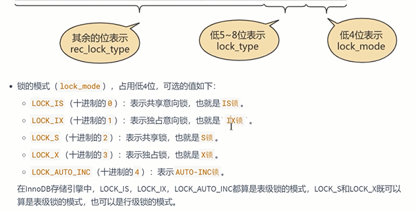
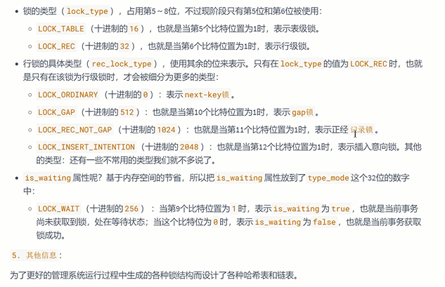
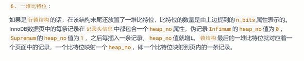
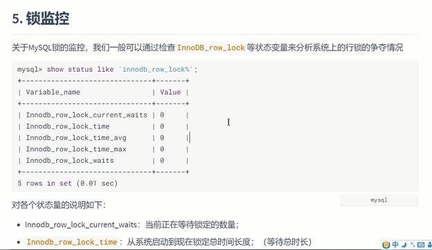
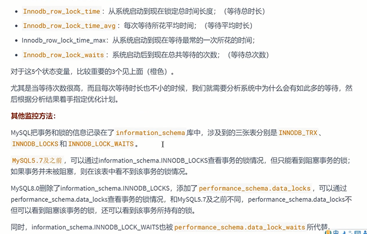

锁结构
---
trx_id 事务ID

is_waiting:当前事务是否在等待

对不同记录加锁，如果

    在同一个事务进行加锁
    
    被加锁的记录在同一个页面
    
    加锁的类型是一样的
    
    等待状态是一样的

就会放在一个 锁结构 中

锁监控
---

show status like 'innodb_row_lock%'

