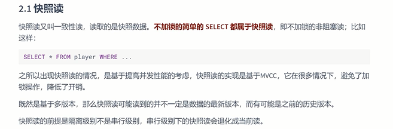
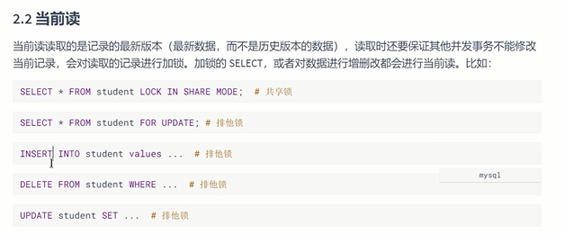
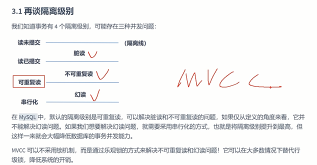
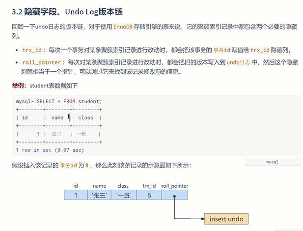
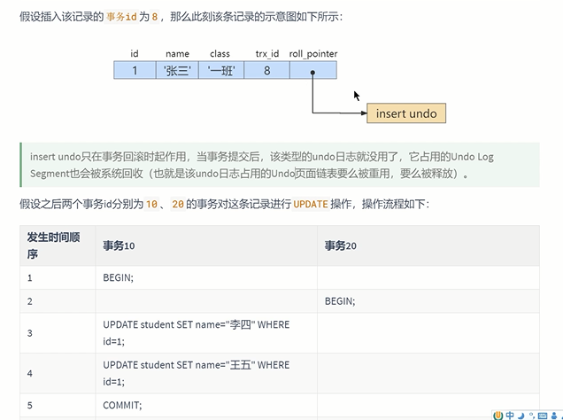
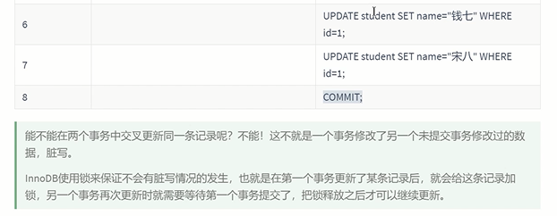
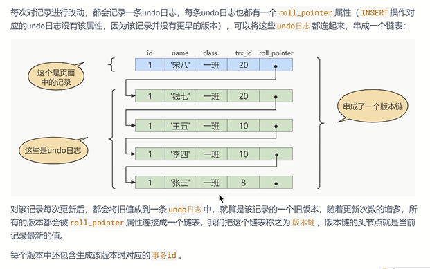
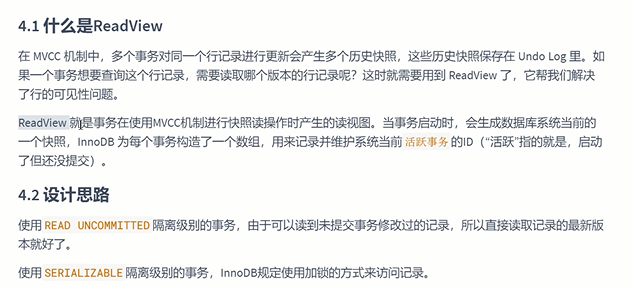
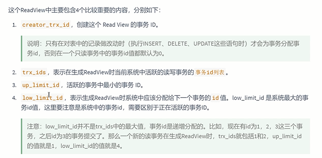
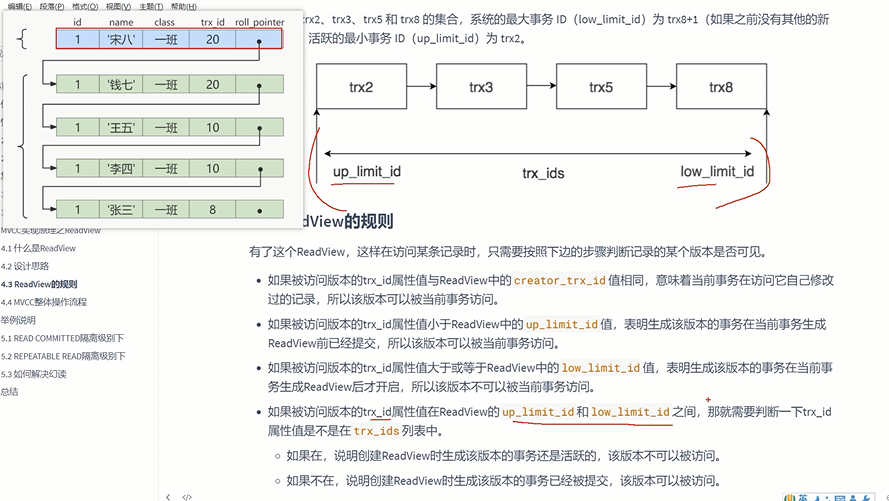

多版本并发控制

通过数据库行的多个版本来实现并发控制

一个事务可以查询 被另一个事务修改的行数据

可以看到这个行数据被更新之前的值

不是等待另一个事务释放锁

读的不是当前值,而是快照值

MVCC实现依赖于： 隐藏字段，undo.log,read view

快照读
---

当前读
---

加锁的操作都是当前读

隔离级别
---

MySQL的隔离级别是可重复读，但是通过MVCC可以解决幻读的问题

隐藏字段 undo.log版本链

undo日志中的roll_pointer将日志连接成一个链表

read view
---

对于读为提交 可以读到未修改的记录 而串行化的事务级别 是用了加锁

针对于 读已提交 和可重复读 必须保证读到了已提交的数据 这里就使用到了 read view

read view的内容
---

creator trx id 创建read view 的事务ID

    只有在增删改的情况才会有新的事务ID， 只读的事务ID默认都是0

trx ids 活跃的事务（未提交的事务）中的事务ID列表

up limit id 活跃中事务的最小事务ID

low limit id 应该给下一个事务的ID （当前事务最大ID加一）

根据当前事务di和 read view的 数据进行对比，判断哪个版本快照的可以访问 是否可见

在read committed 情况下 每次都会生成一个 独立的 read view

在repeatable read情况下 只会在第一次查询时生成一个 read view

参考文档：
---

https://zhuanlan.zhihu.com/p/52977862?utm_source=wechat_session&utm_medium=social&utm_oi=1017210682852421632