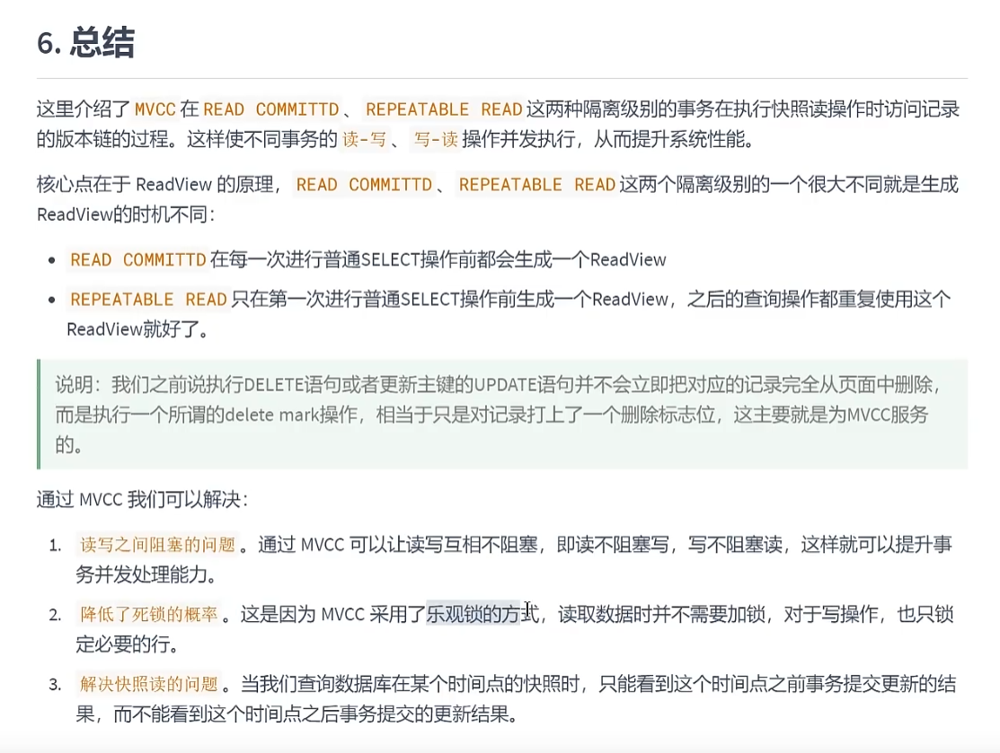
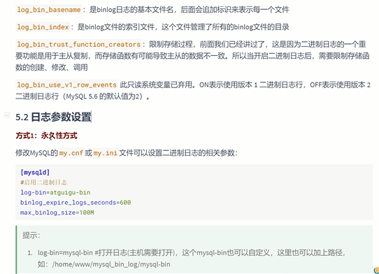
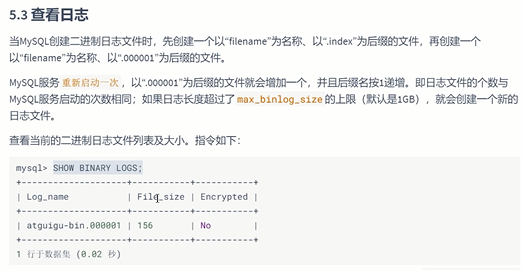
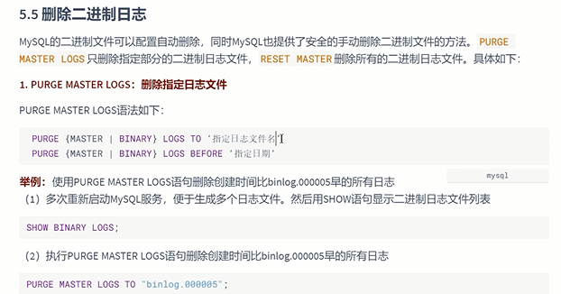

 

像二进制日志 binary log 就是我们平常说的 bin.log

主从复制 中 除了 bin.log 在slave中还有中继日志

通用查询日志和慢查询日志平时不建议开启，会降低性能

slow query log 
---
见 15.定位执行慢的SQL，慢查询日志，show profile.md

通用查询日志
---

错误日志
---

bin.log(binary log) (二进制日志)(变更日志)
---

    记录了所有的DDL和DML(除了数据查询语句)语句
    
    以事件形式记录，还包含语句所执行的消耗的时间

主要作用是`数据恢复`和`数据复制` `数据同步`

主从复制的时候 对于log_bin_trust_function_creators默认是关

如果同步的SQL中有日期函数，主从的服务器时间偏差 就会有问题

每次系统重启都会有一个新的bin.log文件

日志参数含义和设置
---

数据库文件最好不要与日志文件放到一个磁盘上
---

查看bin.log文件
---

SHOW BINARY LOGS;

使用mysqlbinlog命令工具查看bin.log内容

使用mysqlbinlog -v 查看伪SQL

数据恢复的方式
---

先执行`flush logs`命令

    在执行了误删除之后，在尽快的时间内执行‘flush logs；’
    
    这条指令会刷新binlog，也就是重新生成一个binlog文件，
    
    这样保证需要恢复的数据都存储在一个固定的binlog中，新的binlog会写入新的binlog中。
    
    并且binlog的显示时间也很有意思，你在执行flush logs 的时候，
    
    生产新log的同时，截止到当前时间的上一个binlog的修改时间也会同步过来，
    
    因此，更方便我们查找某个时间段对应的binlog

一种是通过position id，指定范围

一种是通过时间来指定范围

按position id 恢复
---

按日期恢复
---

删除bin.log日志
---

