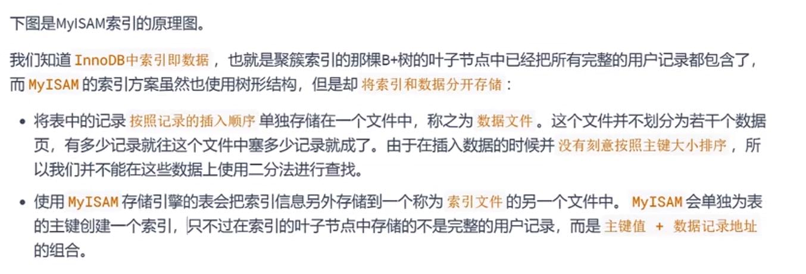
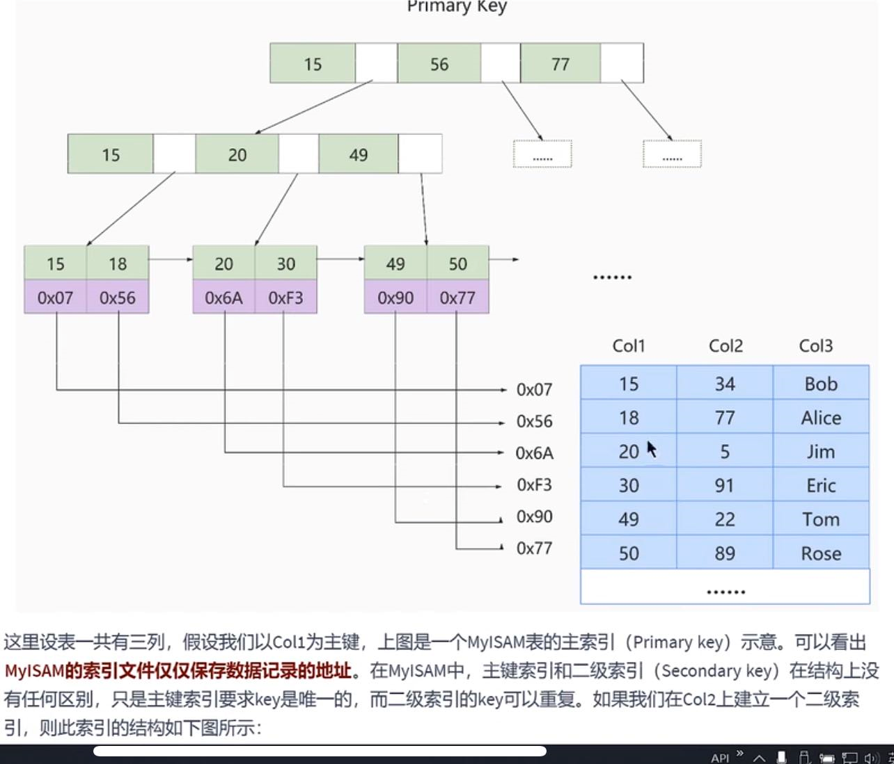
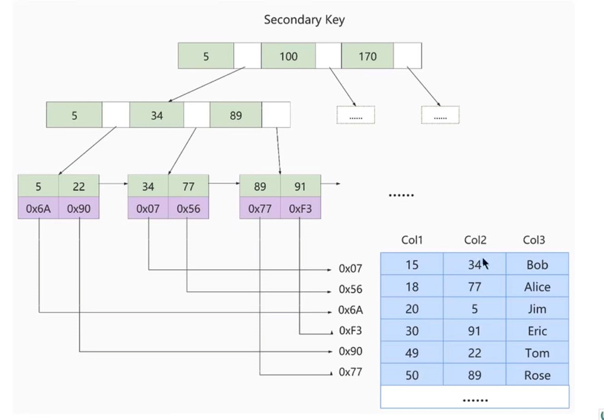
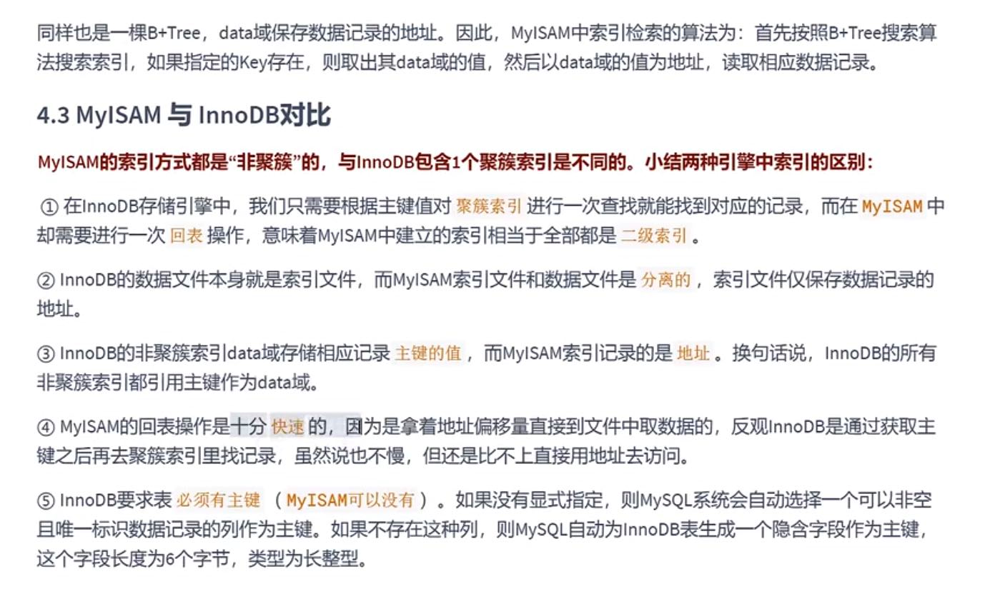

MyISAM的索引方案
---
MyISAM引擎使用b+tree作为索引结构

innoDB必须要有主键（无论是显式还是隐式的），myISAM可以没有主键。

和InnoDB不同的是 InnoDB 聚簇索引叶子节点存放的是完整用户数据，

非聚簇索引存放的是列值和主键值。

而MyISAM中，叶子节点存放的是用户数据（主键值）**记录的地址**。

也就是说，MyISAM中的索引和数据是分开的。

(innoDB存储的是.ibd文件，myISAM存储的是.MYD（my data）和.MYI（my index） 文件)

插入数据不会想innoDB一样根据主键对数据进行排序（索引文件还是有序的，数据文件不需要有序）

叶子节点 记录着 主键值（15），0x07（数据地址）

InnoDB和MyISAM对比
---
myISAM使用到的二级索引（非聚簇索引），先根据索引文件找到数据地址，再根据数据地址找到完整用户数据。

所以说myISAM使用二级索引进行查询 必然会产生回表操作。（索引的地址->地址中的完整数据）

不过根据地址偏移量直接在文件中寻址找数据，是要比innoDB从二级索引找聚簇索引中的文件要快的。

增加索引的代价
---
