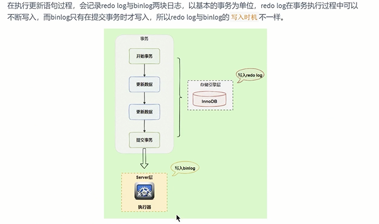
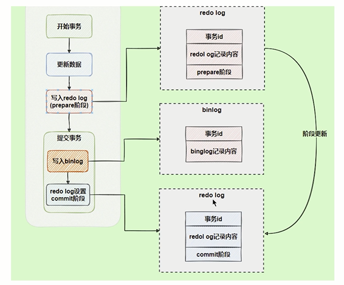
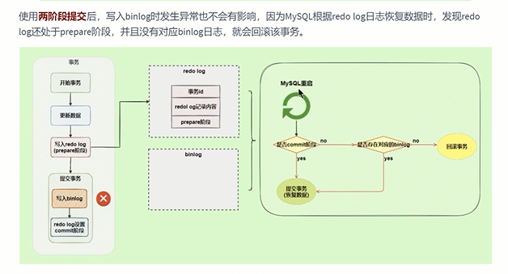

写入机制
---

先写到bin log cache

每个事务都会分配一个 bin log cache

上图中的write是写到 内存的cache的

没有持久化到磁盘 速度是比较快 

上图中的fysnc 才将cache写到磁盘中的bin.log日志

write和fsync的时机有 sync_binlog 控制

默认是0 每次事务提交时只write 系统自动判断何时fsync

但是在fsync时 硬件故障会导致数据丢失

有一种折中的方案是 设置 一个N 每次提交都write 积累到N个事务后进行fsync

bin.log和redo.log的对比
---

redo log 属于物理日志，比如在某数据页某偏移量下写入或删除了某数据。 

是针对数据页内容，属于innoDB存储引擎的

而 bin log 和 undo log 记录的是逻辑日志 SQL的回滚和备份 里面是sql语法的内容

两阶段提交
---

redo log可以在事务执行过程中不断写入，而bin log只在事务提交时写入

因为写入时机不同 如果 redo log 已经将数据持久化， 服务器挂了 bin log 做数据恢复，就会少数据

为了解决两个日志的数据同步问题 innoDB存储引擎提出了 ‘两阶段提交’

将redo log 分为 prepare(准备阶段)和commit(提交阶段)

提交事务时 会 写入bin.log 并 讲redo.log commit(提交)

如果使用两阶段提交  MySQL 根据redo log恢复数据 发现 redo.log 处于prepare阶段

且没有bin log日志 就回滚事务

如果redo log在commit时异常 但是能找到bin.log 就能找到SQL。就能提交事务恢复数据。

