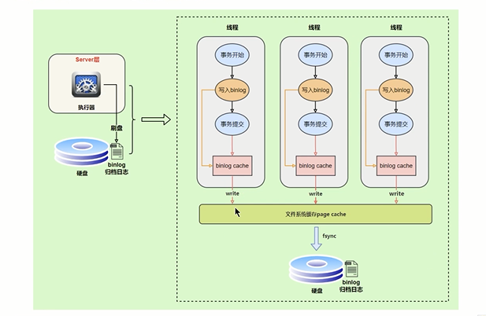
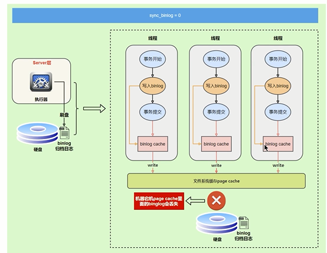

写入机制
---

先写到bin log cache

每个事务都会分配一个 bin log cache

上图中的write是写到 内存的cache的

没有持久化到磁盘 速度是比较快 

上图中的fysnc 才将cache写到磁盘中的bin.log日志

write和fsync的时机有 sync_binlog 控制

默认是0 每次事务提交时只write 系统自动判断何时fsync

但是在fsync时 硬件故障会导致数据丢失

