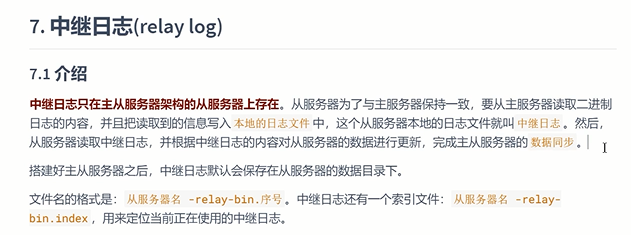
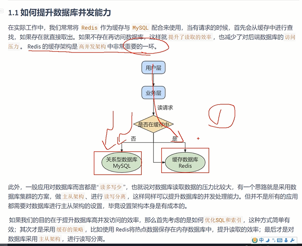
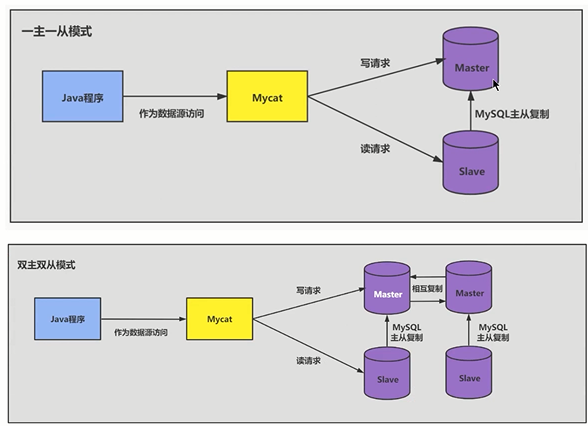
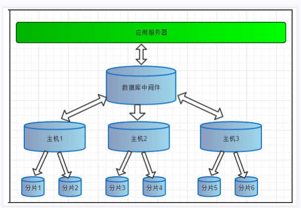
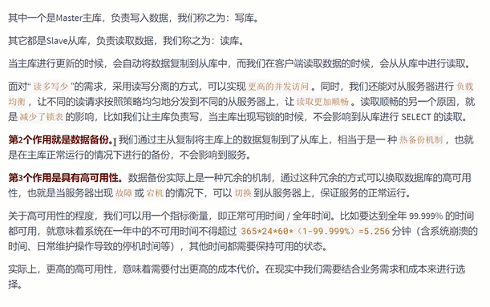
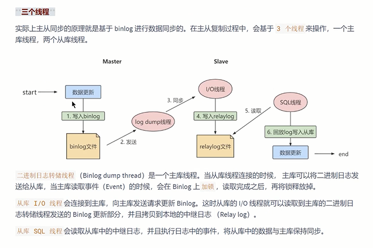
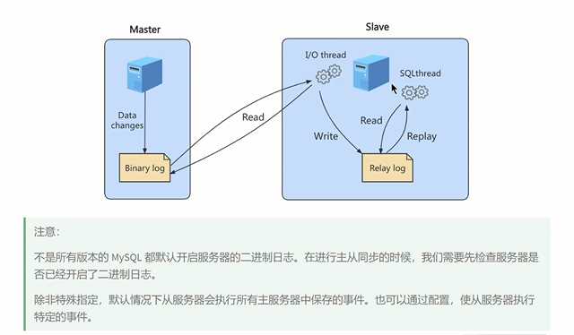
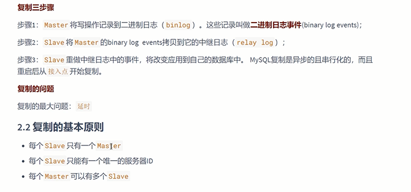

中继日志 relay log
---
中继日志与二进制文件相同

可以用 mysqlbinlog命令工具查看

主从复制
---

如何提供并发能力

从成本角度看，SQL优化 与 合理的索引 最为简单有效；

其次采用 热点数据 使用 缓存策略 从内存 而不是 磁盘 获取数据

最后考虑主从架构 到 读写分离 分库分表

主从复制的作用

    读写分离  master称为写库， slave称为读库

    数据备份  相当于热备份

    高可用性 主库出现故障 可以切换到从库 保证服务运行

主从复制的原理
---

    二进制文件转储线程 主库线程 从库连接主库 ，主库将bin log发送给从库 会在bing log `加锁` 读取完成后解锁

    从库IO线程 从主库读取到bin log 更新部分 拷贝到本地的中继日志 relay log

    从库SQL线程 读取从库的relay log 从而实现主从保持同步数据。

一个slave只能有一个master 

一个master可以有多个slave

每个slave只能有一个服务器ID

