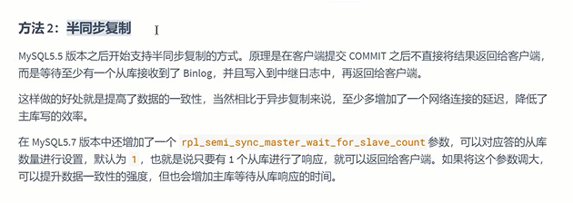
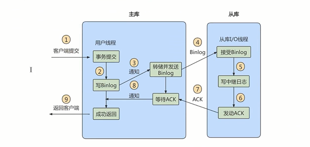
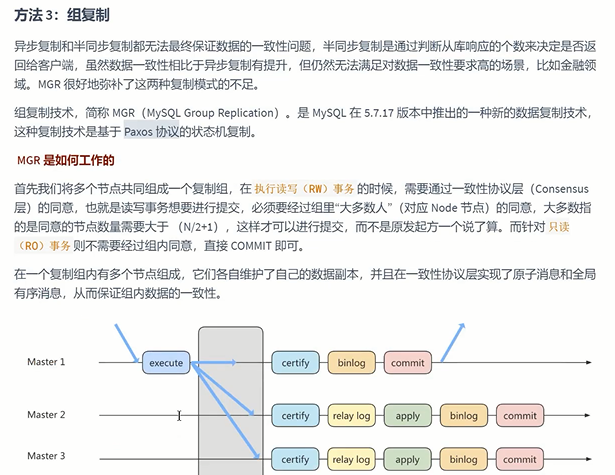
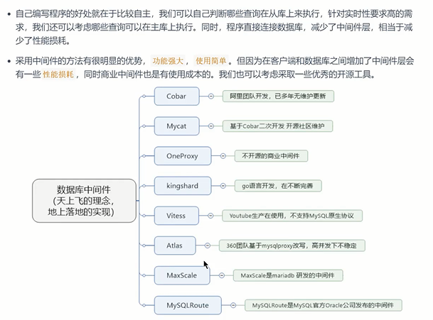

读库与写库要保证最终一致性

（异步复制和半同步复制不能保证最终一致性）

写数据必须请求到写库；

读数据不一定到读库（对实时要求高的可以请求写库）；

    优化SQL，减少批量操作
    
    使用短的链路，主从库的举例尽量短，提升端口带宽，减少网络延迟。
    
    提高从库配置，减少主库写bin.log和从库读bin.log的性能差
    
    实时性强的业务只走主库，从库只做备灾，备份

异步复制
---

客户端请求事务 主库commit后直接将结果返回

异步将bin.log同步到从库的relay.log

半同步复制（有网络开销 性能下降）
---

客户端请求事务 主库commit后不直接将结果返回

确保有一个slave（配置 rpl_semi_sync_master_wait_for_slave_count）

接受完主服务器发送的binlog日志文件并写入到自己的中继日志relay log里，

然后会给master信号， 告诉对方已经接收完毕，

这样master才能把事物成功commit。

这样就保证了master-slave的数据绝对的一致（但是以牺牲master的性能为代价).

但等待时间也是可以调整的。

组复制 （MySQL 5.7之后出现）
---

读写事务想进行提交 必须经过一定的节点统一，如果是N个节点 那就是（N/2+1）个节点同意

才能commit, 如果是只读事务，直接可以commit

其他中间件
---

