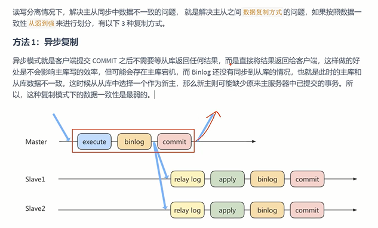

读库与写库要保证最终一致性

写数据必须请求到写库；

读数据不一定到读库（对实时要求高的可以请求写库）；

    优化SQL，减少批量操作
    
    使用短的链路，主从库的举例尽量短，提升端口带宽，减少网络延迟。
    
    提高从库配置，减少主库写bin.log和从库读bin.log的性能差
    
    实时性强的业务只走主库，从库只做备灾，备份

异步复制
---

