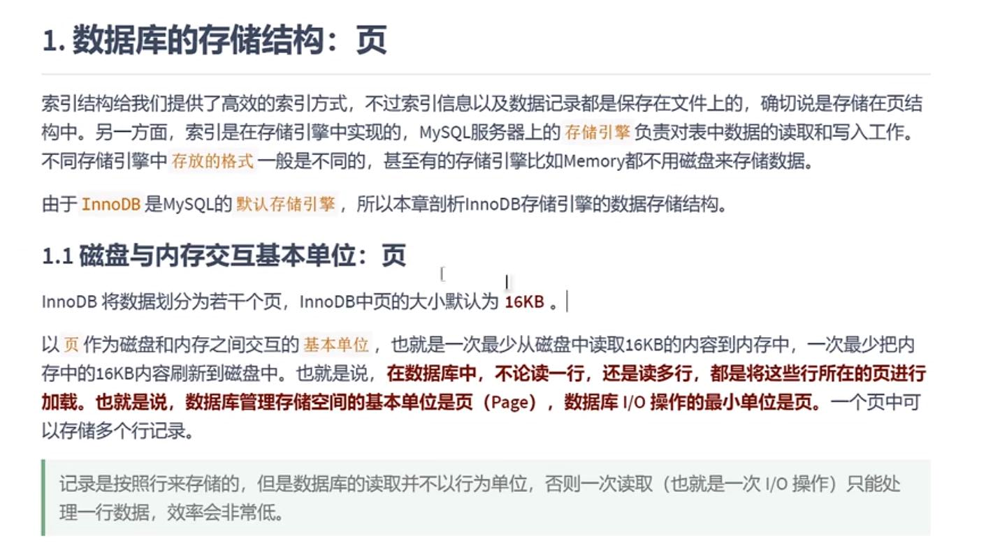
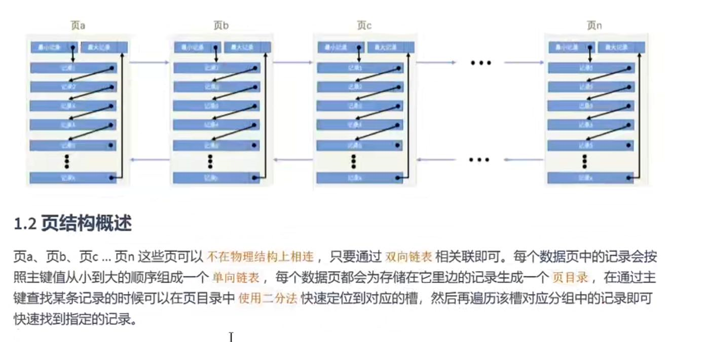
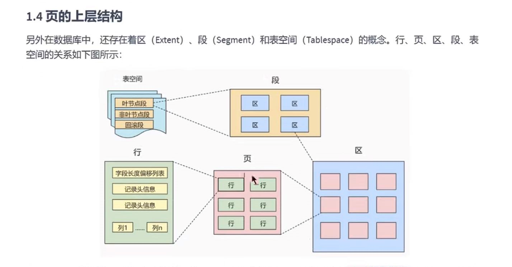
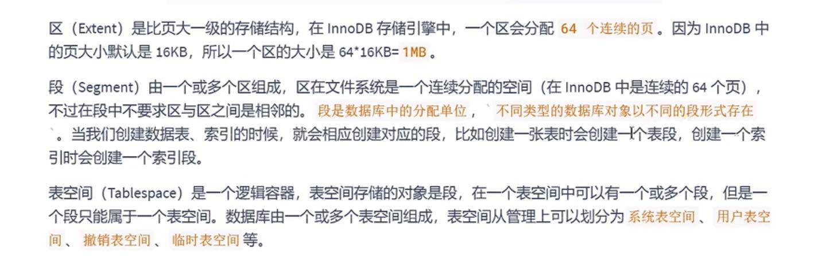

数据库的存储结构 页
---

磁盘与内存交互的基本单位

innoDB中的页大小默认为16KB

内存读取磁盘中的数据 每次最少堆区16KB(也就是一页的数据)

页和页直接通过双向链表连接

页内的数据按照主键大小单调顺序组成一个单项链表 页内数据的查询使用二分法定位

区（extent）（范围 程度） 一个区分配64个页 大小是在16KB*64=1MB

段（segment）由一个或者多个区组成， 一个表空间（table space）由一个或者多个段组成

行(row)->页(page)->区(extent)->段(segment)->表空间（table space）

