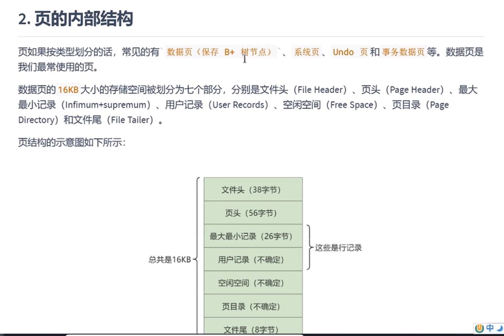
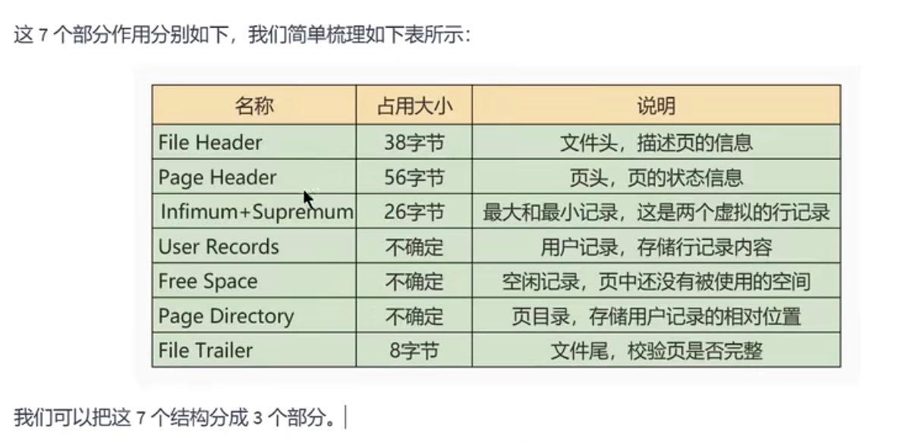
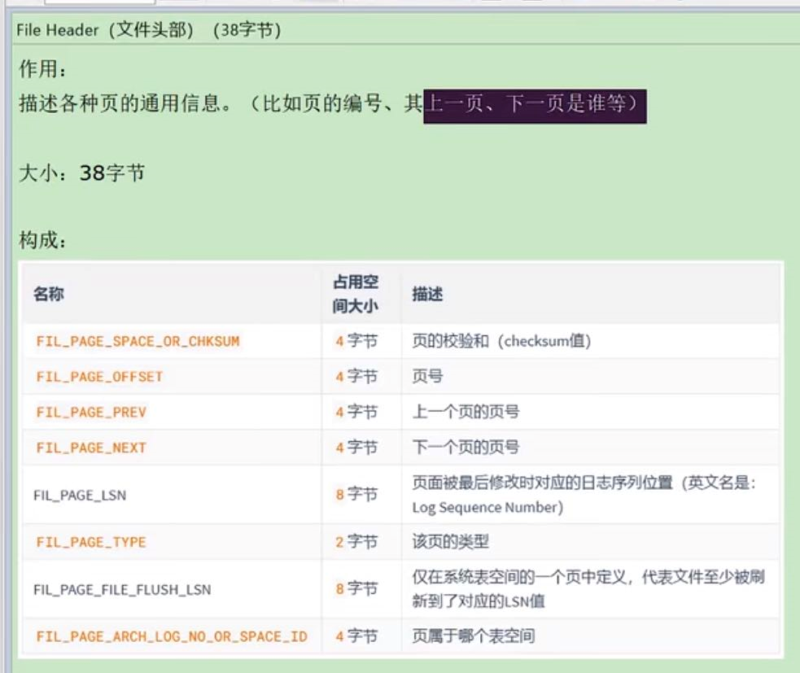
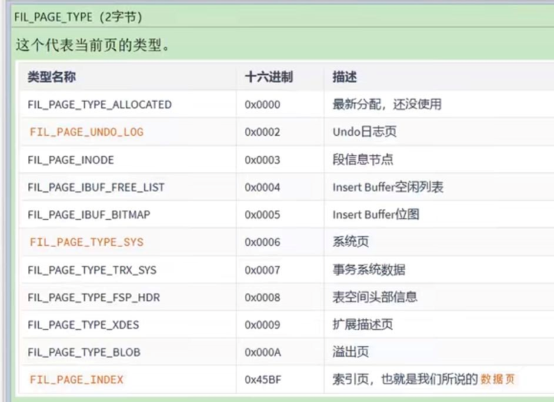
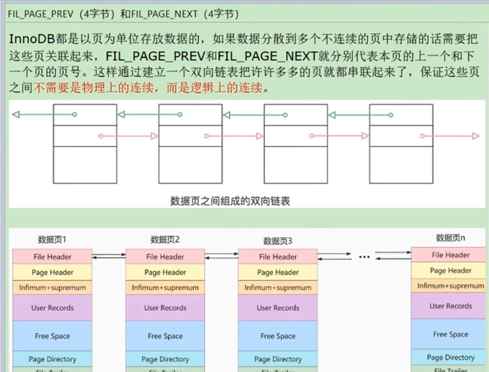
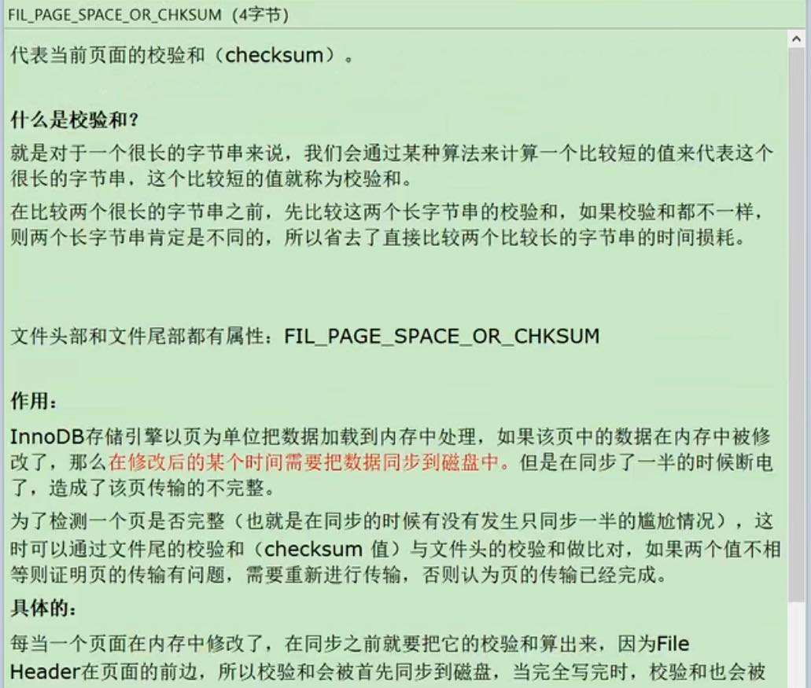
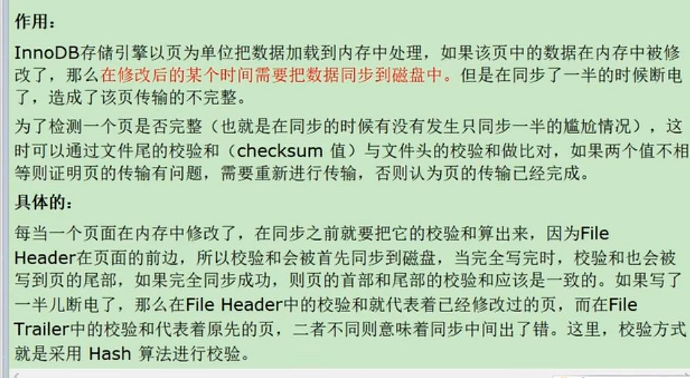
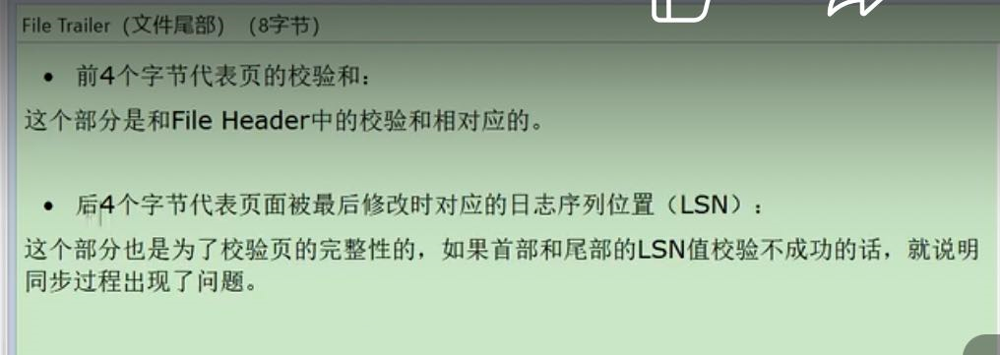

页 按类型分，常用的如`数据页` `系统页` `undo页` `事务数据页` 等

    文件头 file header
    
    页头 page header
    
    最大最小记录 infimum+supermum
    
    用户记录 user record
    
    空闲空间 free space
    
    页目录 page directory
    
    文件尾 file trailer

file header
---

fil_page_offset
---

fil_page_type
---

fil_page_prev和fil_page_next
---

fil_page_space_or_chksum
---

fil_page_lsn
---

file trailer
---
