free space
---

user records
---
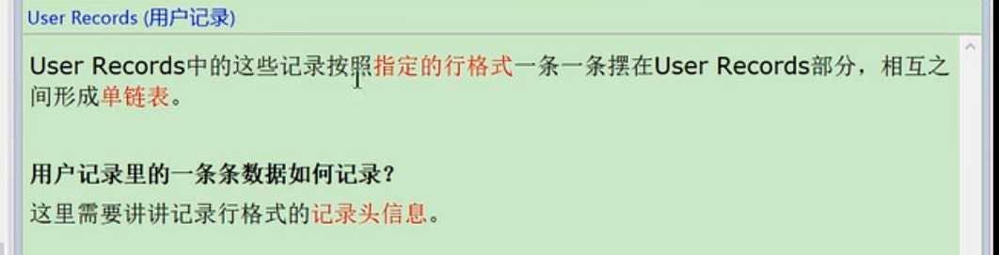

记录头信息
---
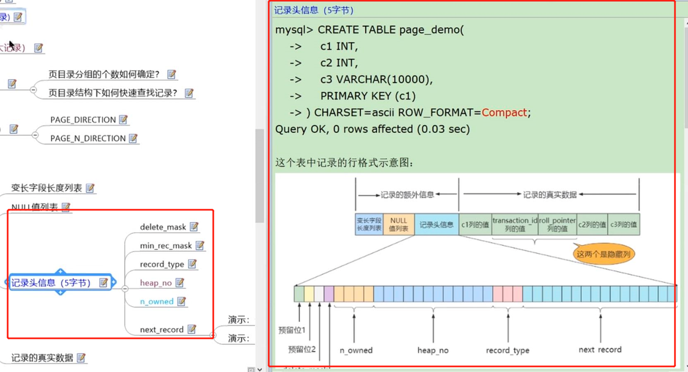

delete_mark
---
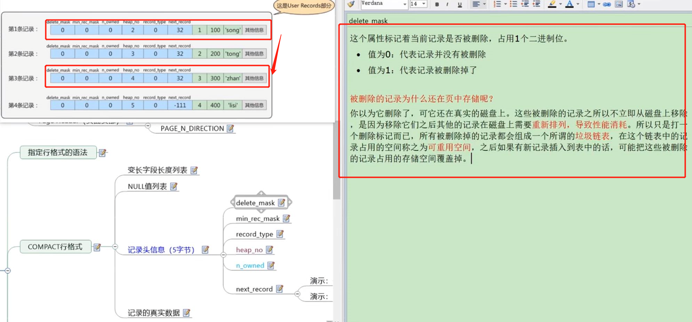

min_rec_mask
---
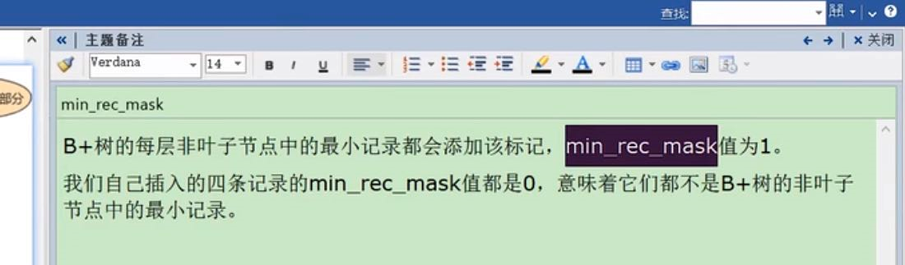

record_type
---
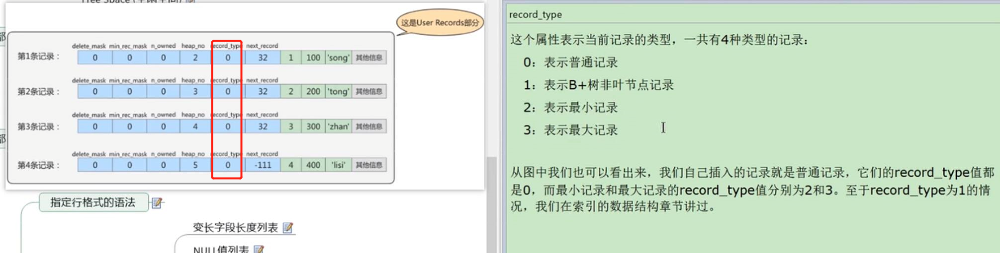

heap_no
---
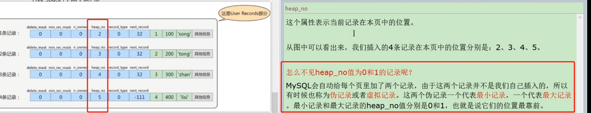

infimum + supermum (最小最大记录)
---
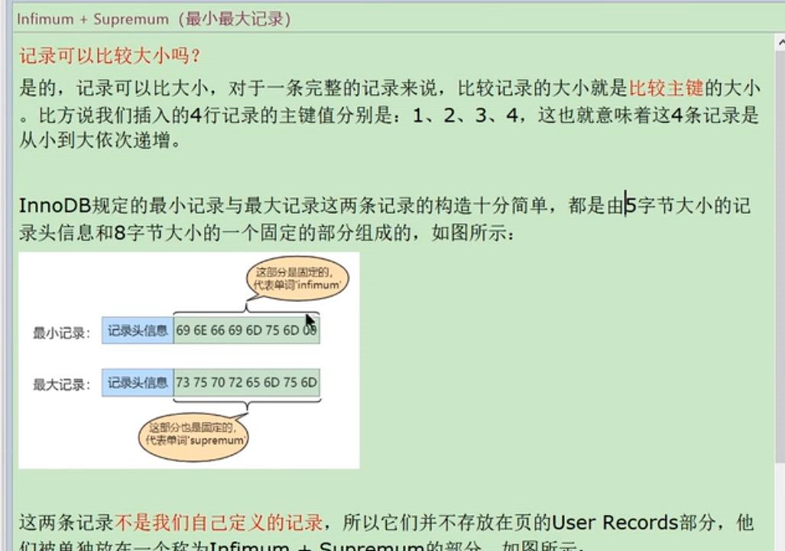

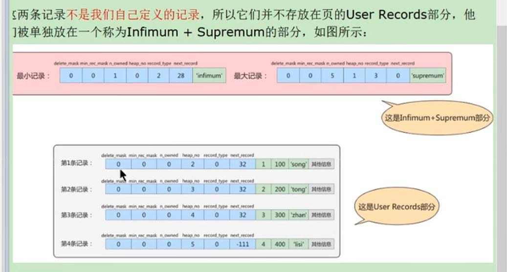

n_owned
---
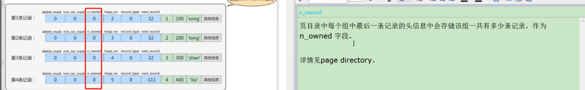

next_record
---
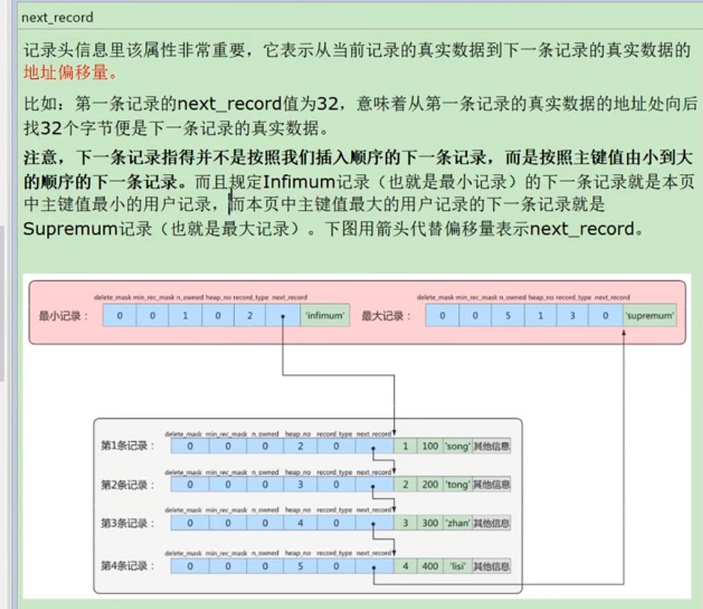

删除操作
---
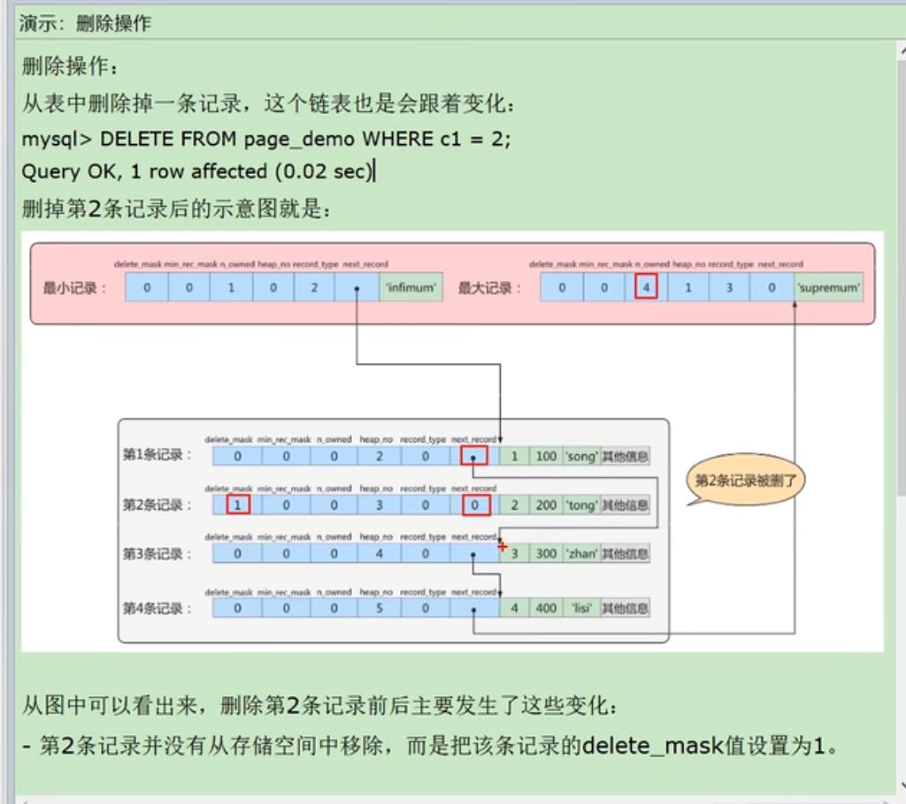

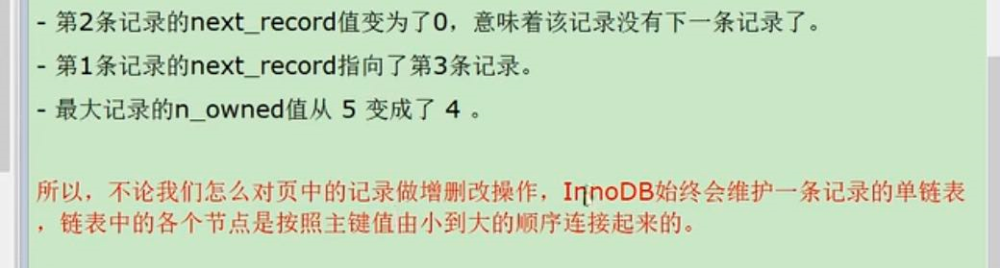

添加操作
---
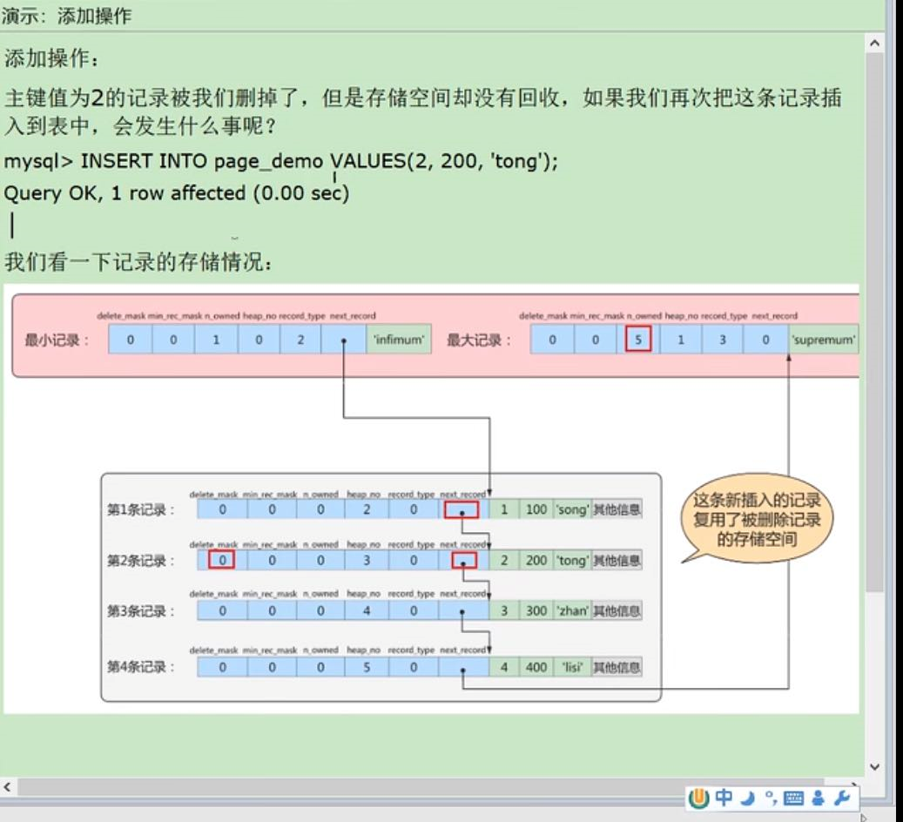

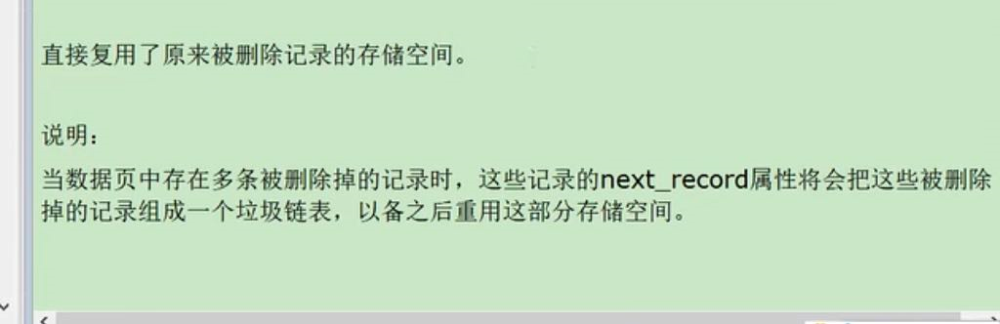