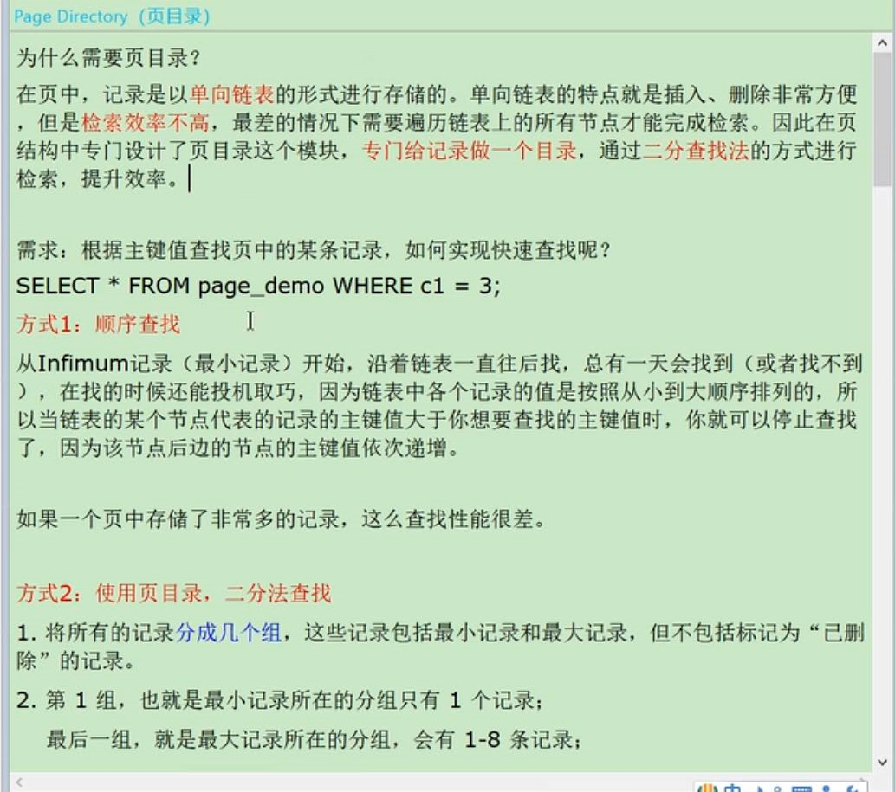
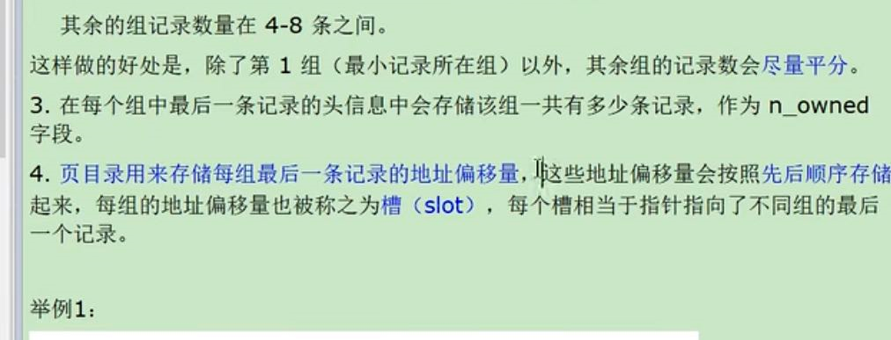
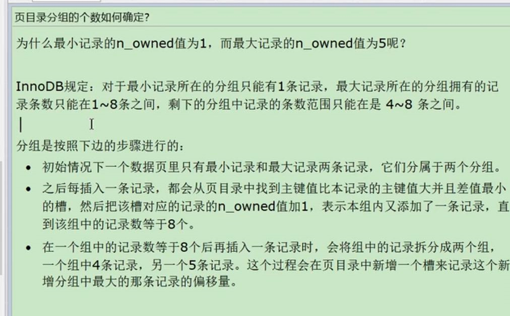
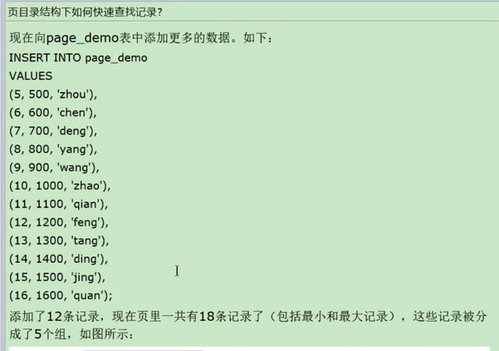
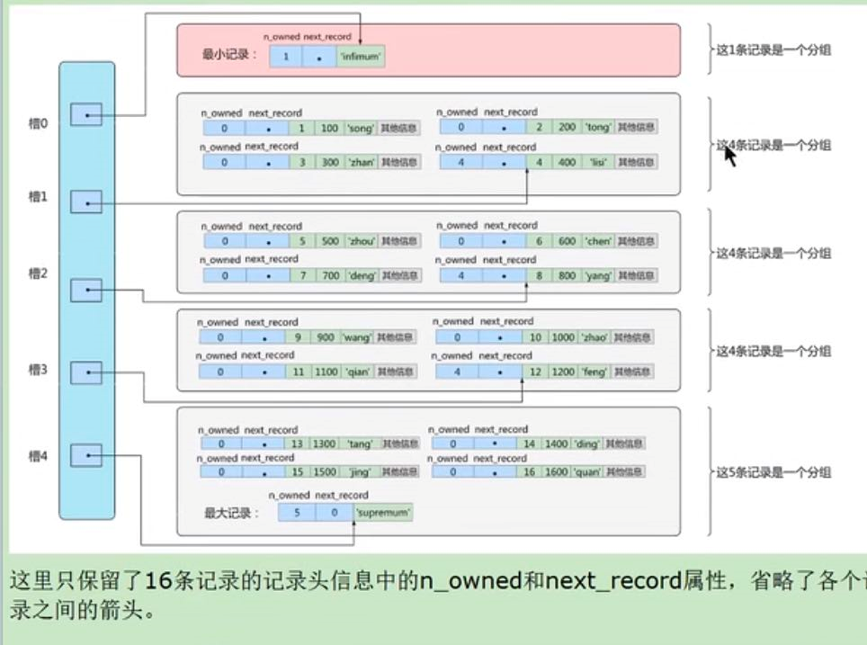
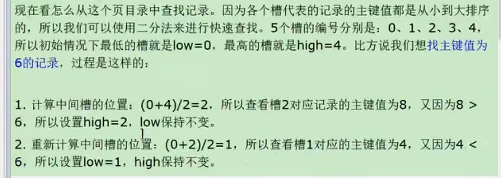
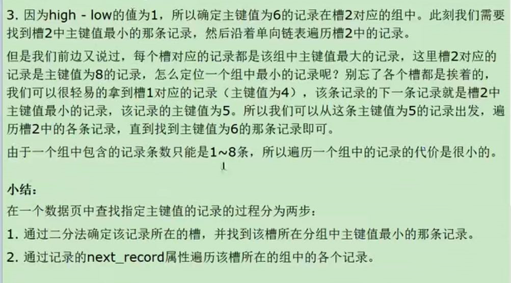
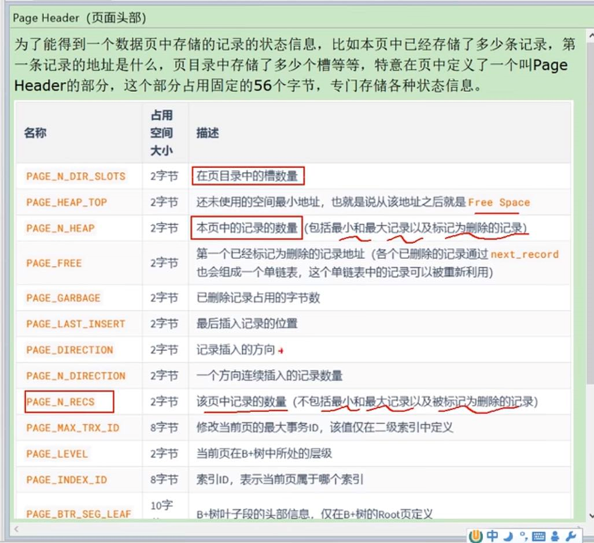

page directory(页目录)
---
在页内搜索数据时，

并非把页内所以的记录都放在一个组中。

而是把页内的用户数据 按顺序分成若干个组（不包括delete_mark标记的记录），

这个组也就是槽slot 槽中该槽内最大值的记录

除了最小记录单独放在一个槽中

其他槽的容量在4-8直接， 如果超过了8 就会拆成4+5的两个槽

使用数组形式存储，二分查找到数据对应的组后，再从组里进行查找。

页目录分组的个数如何确定？
---

页目录结构下如何快速查找记录？
---

page header （页面头）
---

