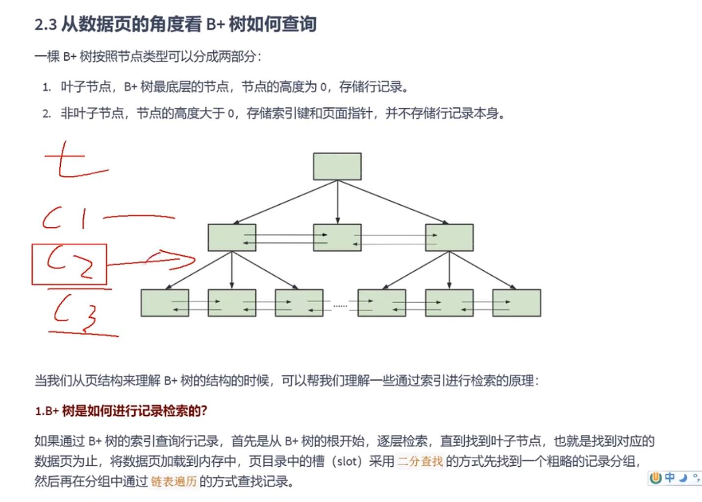
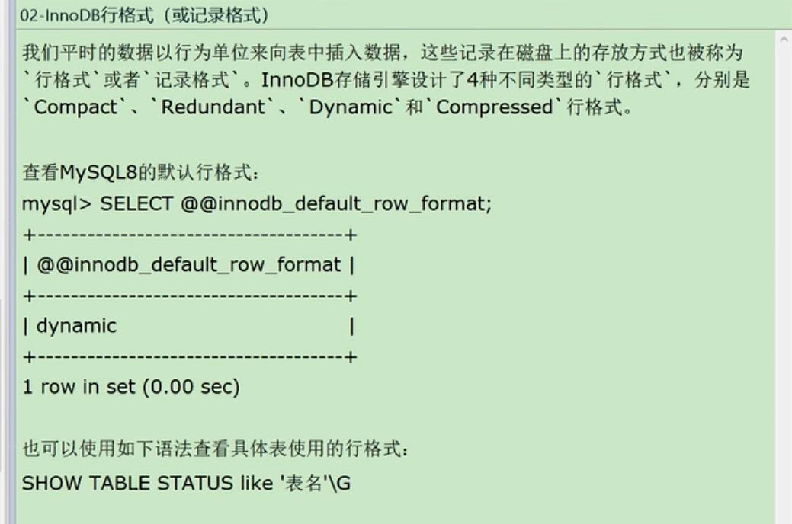
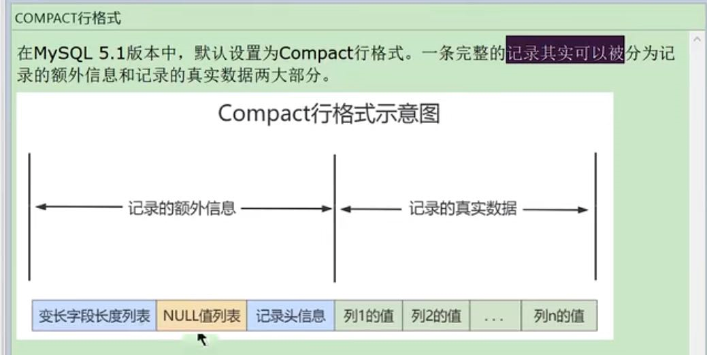
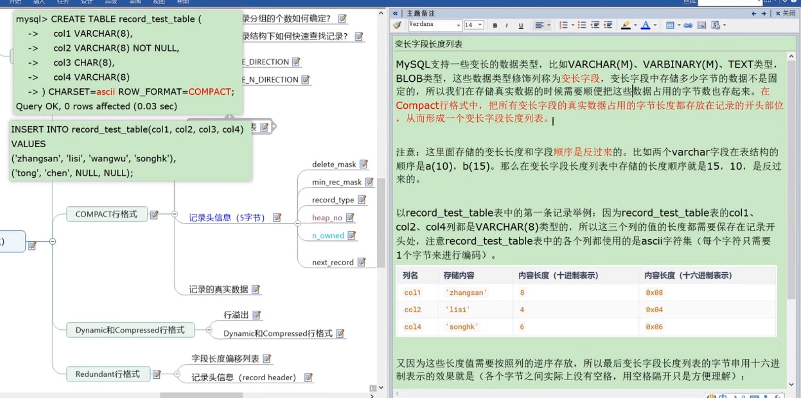
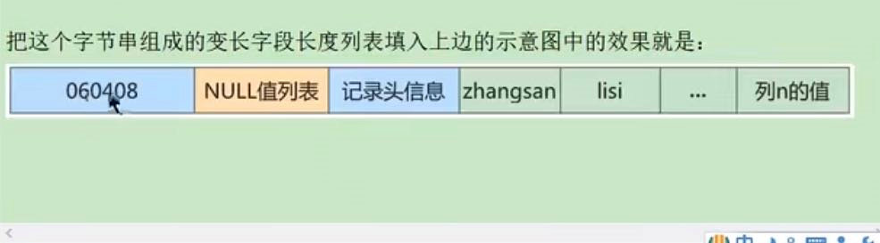
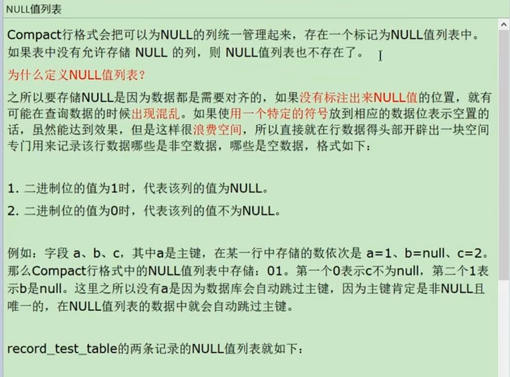
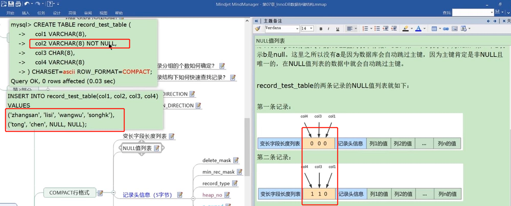
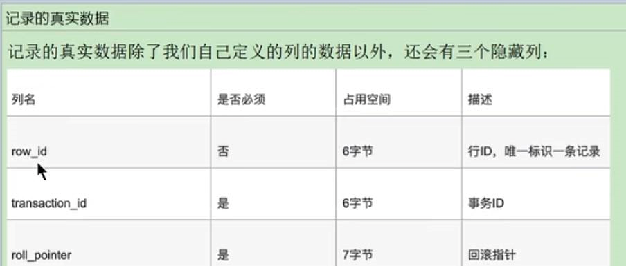
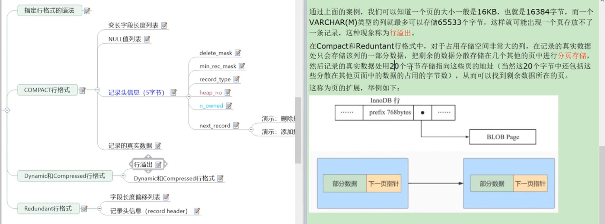
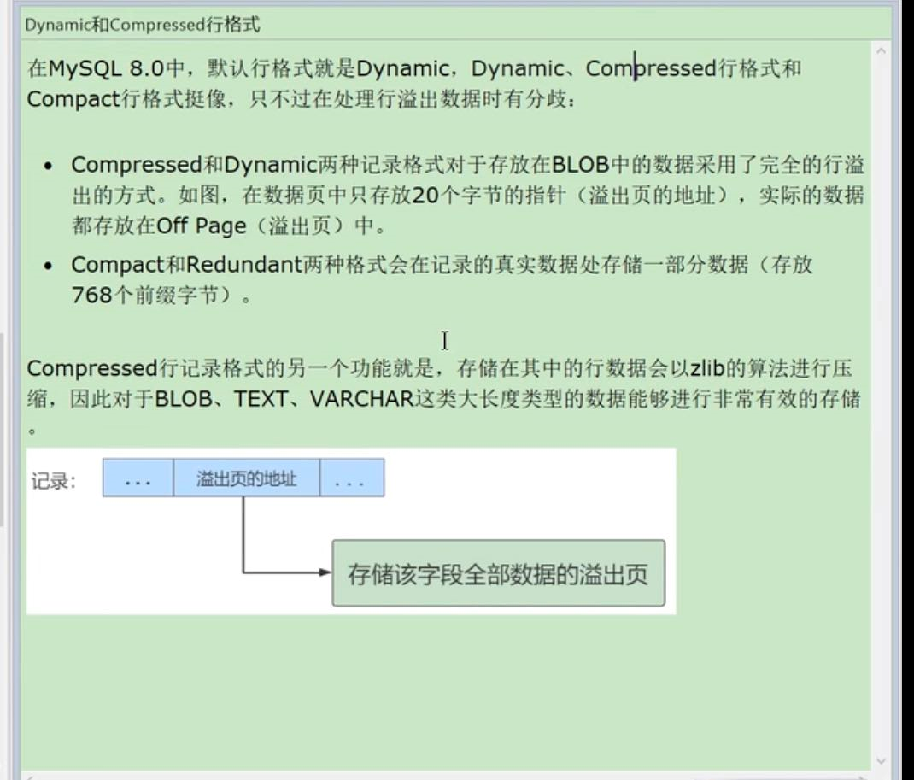

从数据库页的角度看B+树如何查询
---

从磁盘查询数据 并非按行读取，是按页读取，

唯一索引的话 在页内找到关键字后会停止搜索

普通索引 会多几次 `判断下一条记录的操作`

行格式或者记录格式
---

compact格式
---

变长字段长度列表
---

null值列表
---

记录的真实数据
---
如果聚簇索引没有设置主键ID和非空唯一索引， 默认的隐式ID就是row_id

行溢出
---

compact会将溢出的数据进行分页存储

compressed会使用zlib的算法对象大长度的数据进行压缩

