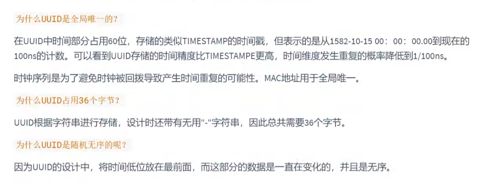
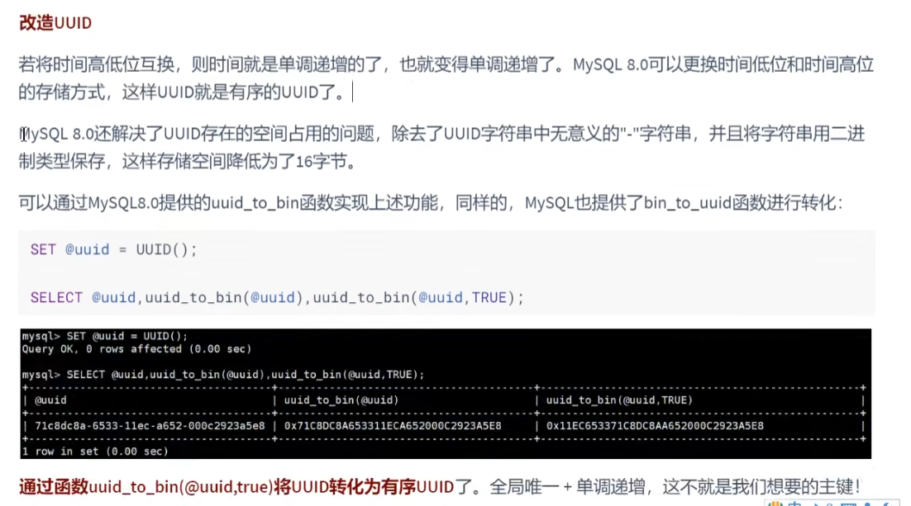
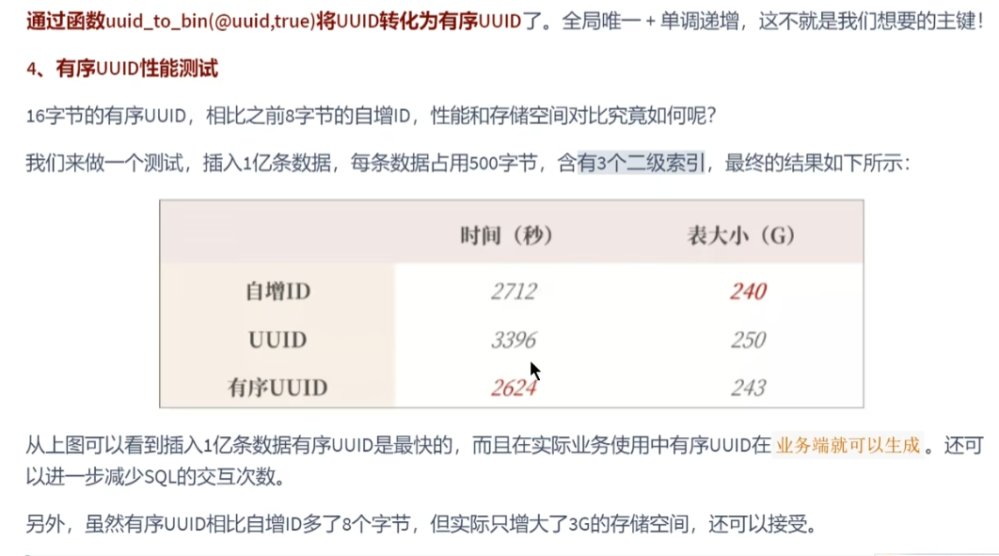

分析
---

对于非业务表，比如监控，日志，告警等，使用自增ID没什么问题。

对于业务表来说，不建议使用业务字段。

类似于手机号 持有人 换手机了 运营商把手机号回收后，有另外的人使用，两个人都注册是用户信息 那这个手机号就不能甄别是哪个用户。

会员卡号和手机号也是同理，都会出现回收的可能。

而身份证的话，国家对个人信息隐私的泄漏，监管越来越严，站在用户角度来说，对方也是十分情愿用这种实名制的方式注册用户。

那么对于核心业务表来说，比如订单表

主键的设计应该是全局唯一且单调递增（避免页分裂，索引数据非递增插入导致页分裂）的

UUID
---
全局唯一，36个字节，无序，插入性能差。

UUID是无序的，因为时间低位在最前面

在8.0中，MySQL提供了函数实现了更换时间低位和高位的存储方式，这样UUID就是有序的了，用二进制的方式保存。只有16字节，之前都是32字节。

