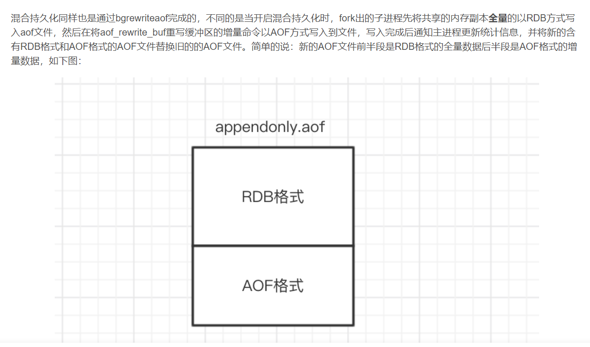

持久化配置
---

混合持久化
---

Redis 5.0 默认值为 yes

redis.conf

    aof-use-rdb-preamble no

混合持久化的加载流程如下

判断是否开启 AOF 持久化，开启继续执行后续流程，未开启执行加载 RDB 文件的流程；

判断 appendonly.aof 文件是否存在，文件存在则执行后续流程；

判断 AOF 文件开头是 RDB 的格式, 先加载 RDB 内容再加载剩余的 AOF 内容；

判断 AOF 文件开头不是 RDB 的格式，直接以 AOF 格式加载整个文件。

