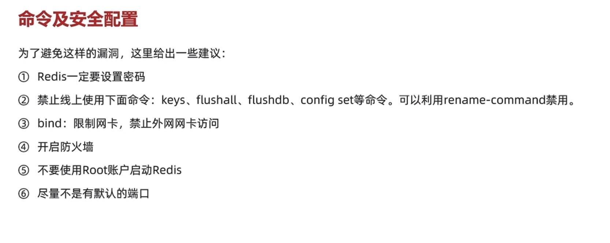
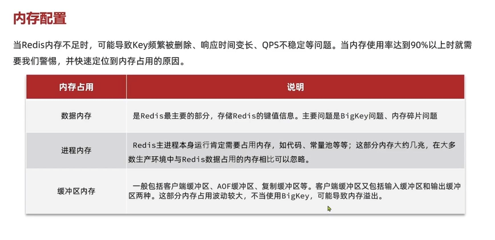
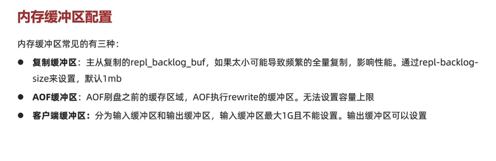

命令及安全配置
---

redis.conf 修改 rename-command配置

    禁用的具体做法是，修改服务器的配置文件redis.conf，新增以下命令：
    
    rename-command FLUSHALL ""
    
    rename-command FLUSHDB ""
    
    rename-command CONFIG ""
    
    rename-command KEYS ""

redis.conf 修改 bind

    一般一台服务器有多个网卡 有外网网卡， 局域网网卡， 建议绑定局域网网卡

内存配置
---

数据内存 
    
    存储redis键值信息，主要问题是big key问题，和内存碎片问题

    big key由业务导致， 而内存碎片问题

    分配内存时以8字节，16字节，32字节递增，当数据需要7个字节，那就会分配8字节的连续空间

    就会有一个字节是空的，这就是内存碎片，如果数据修改，变长用到了8字节，就不要扩容，

    当Redis版本是4.0以下，那么我们只能通过重启实例解决问题，但需要注意的是重启会有部分数据丢失，即使开启了持久化。

    当Redis版本是4.0以上，我们可以通过配置activedefrag yes自动碎片清理来完成，简单形容就是零换整的思想，将空闲内存碎片合并到一起，形成一片连续的空间，如下所示

进程内存

    主进程需要占用内存，大概几兆

缓冲区内存 

    一般是客户端缓冲区 AOF缓冲区 复制缓冲区等 这部分内存占用波动大，不当的使用big key 可能导致内存溢出

内存缓冲区
---

输入缓冲区 增删改查命令 阻塞有可能会导致输入缓冲区 溢出 

输出缓冲区 返回的键值数据