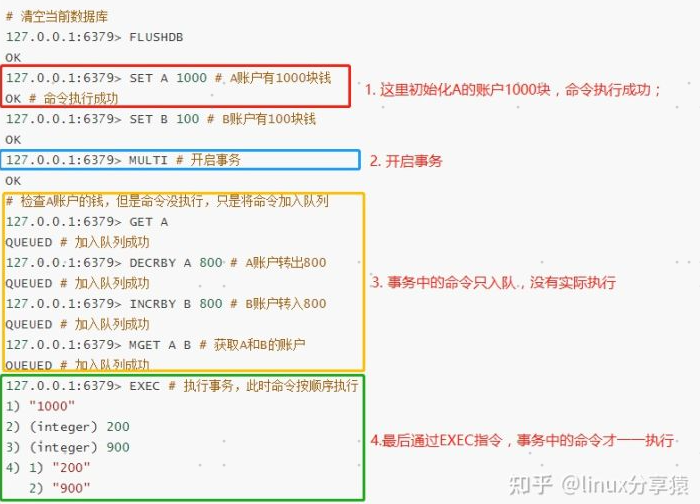

Redis事务的相关命令如下：
---

MULTI：标识一个事务的开启，即开启事务；

EXEC：执行事务中的所有命令，即提交；

DISCARD：放弃事务；和回滚不一样，Redis事务不支持回滚。

WATCH：监视Key改变，用于实现乐观锁。如果监视的Key的值改变，事务最终会执行失败。

UNWATCH：放弃监视。

Redis事务没有隔离级别
---

Redis事务优缺点
---

优点

    一次性按顺序执行多个Redis命令，不受其他客户端命令请求影响；
    
    事务中的命令要么都执行(命令间执行失败互相不影响)，要么都不执行(比如中间有命令语法错误)；

缺点
    
    事务执行时，不能保证原子性；

    命令入队每次都需要和服务器进行交互，增加带宽；