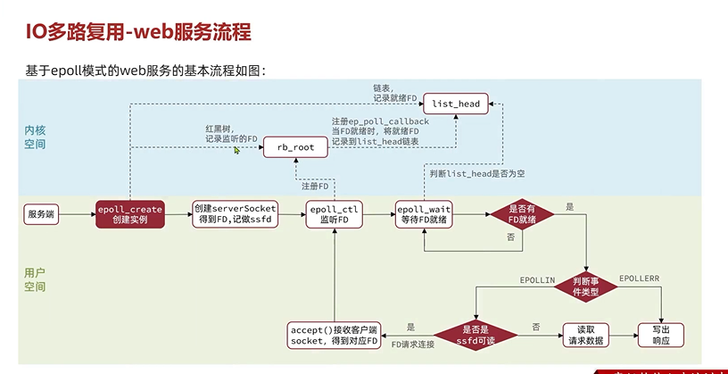

流程图
---

epoll_create(创建实例)
---

创建rb_root 记录要监听的FD

list_head 链表记录就绪的FD

创建serverSocket
---

得到FD，记作ss(ss=serverSocket)fd

epoll_ctl(监听FD)
---

把这个ssfd,通过 epoll_ctl 注册到 rb_root

并将ep_poll_callback注册到 rb_root 

当这个ssfd就绪时，讲就绪的fd记录到list_head链表中

epoll_wait(等待FD就绪，睡眠，被唤醒)
---

判断list_head是否为空

阻塞等待(默认阻塞)是否有FD就绪

如果没有 接着睡眠

如果有FD就绪了 判断事件类型（判断是不是server socket可读，因为可能有其他事件）

是否是ssfd可读

如果是的话 accept（）接收客户端socket，得到对应的ssfd

然后epoll_ctl监听这个FD

