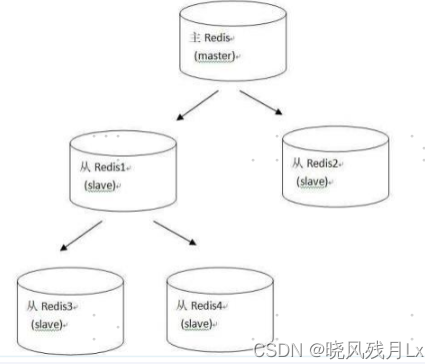
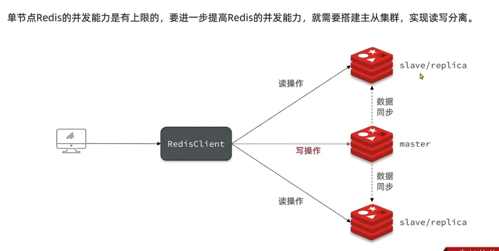
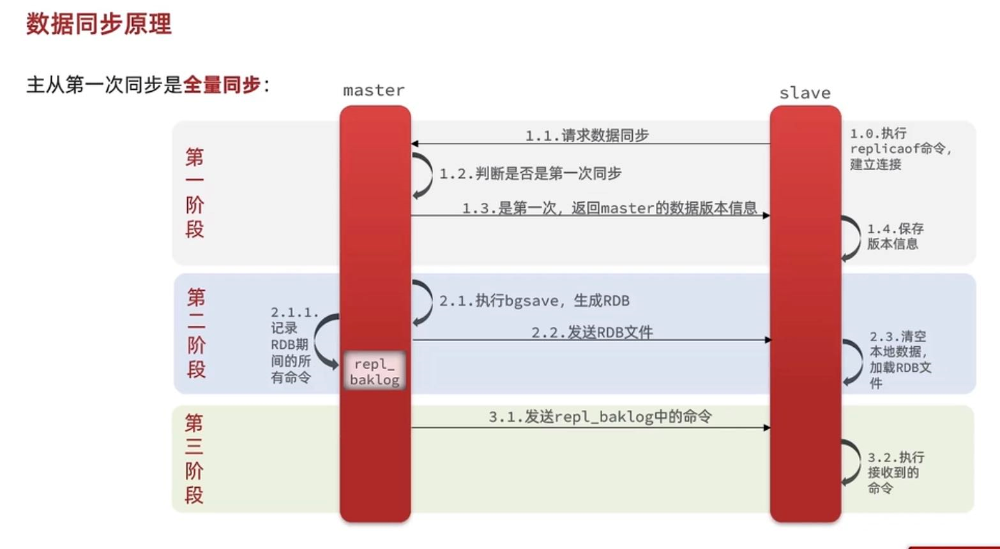
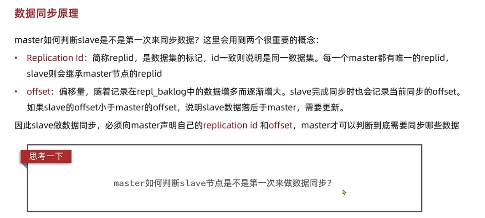
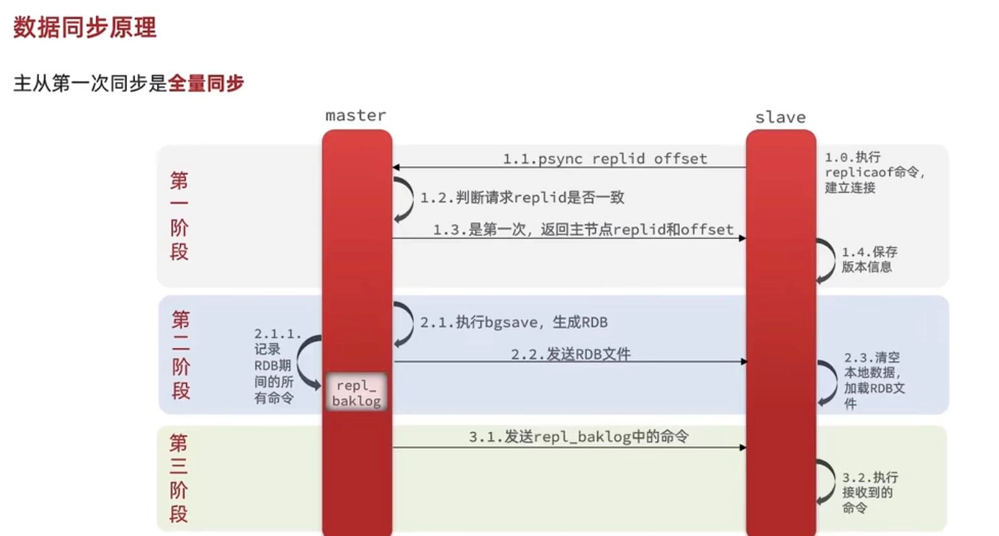
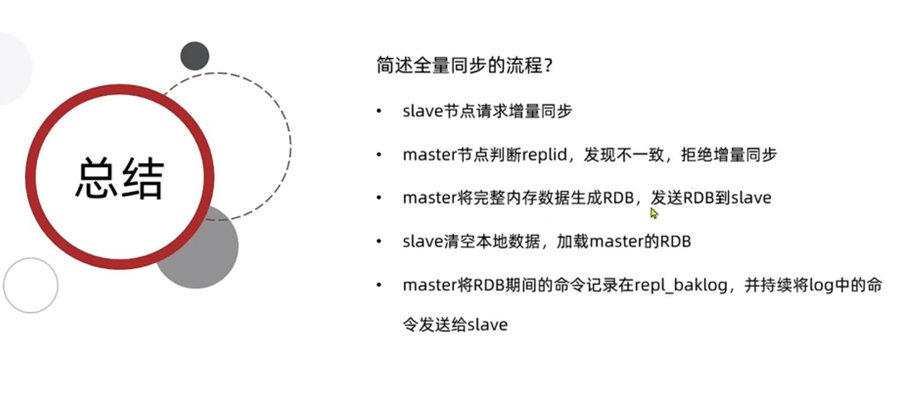

主从复制缺点
---

复制延时，信号衰减：

由于所有的写操作都是先在Master上操作，然后同步更新到Slave上，所以从Master同步到Slave机器有一定的延迟，

当系统很繁忙的时候，延迟问题会更加严重，Slave机器数量的增加也会使这个问题更加严重。

master宕机：

默认情况下不会在slave节点自动重选一个master（需要哨兵模式）

需要人工干预

-------------------------

master  处理写请求

slave/replica   处理读请求

全量同步
---

第一阶段

    replica请求master数据同步

    master判断是否第一次同步 是第一次 返回master数据版本信息

    replica保存master数据版本信息

第二阶段

    master执行bgsave命令 生成RDB 发送RDB文件
    
    replica清空本地文件，加载RDB文件

    在生成RDB的同时，记录RDB期间所有的命令到 `repl_baklog`

第三阶段

    master发送rel_baklog中的命令 ， replica接收到执行命令

    之后的命令都记录到rel_baklog中，发送给replica

master如何判断replica是不是第一次同步
---

replica做数据同步，必须向master 声明自己的

    replication id (每个master都有自己的唯一的replid，slave会继承master的replId)

    offset 数据偏移量 

总结全量同步
---

    
    
    