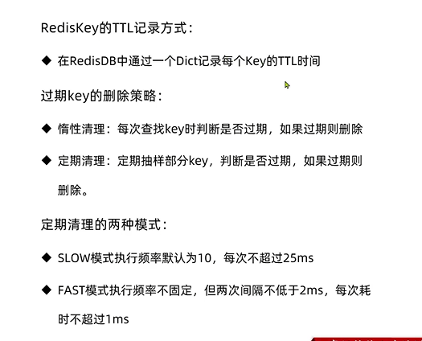

过期策略
---

key-value保存在dict结构中

在database中 有两个dictionary 

一个来记录key-value

另一个用来记录key-TTL

    dict *expires (e ke si pei er)

如下图所示 dict中key=name,val=100 的 记录的就是过期时间

惰性删除
---

不是TTL(Time To Live)到期后自动删除，而是访问一个key的时候检查key的存活时间

如果过期才删除

惰性删除的问题
---

如果很多key长时间不访问，就会对内存造成压力

过期策略-周期删除
---

周期性的抽样部分过期的key

创建server socket，创建event pool，讲server socket注册到event pool

执行aeMain方法，开始事件循环

slow模式规则
---

执行频率为server.hz 默认10 每秒10次 每次执行100ms

fast模式规则
---

执行频率受before sleep()调用频率影响

总结
---

redis中如何记录TTL？

    在redis DB中通过一个dict记录每个key的TTL时间

过期key的删除策略？

    惰性删除 每次查找key的时候判断是否过期，如果过期则删除

    定期清理 定期抽样部分key 判断是否过期 如果过期则删除

定期清理的两种模式

    slow模式执行频率默认为10 每次不超过25ms

    fast模式执行频率不顾腚 但是两次间隔不低于2ms 每次耗时不超过1ms

