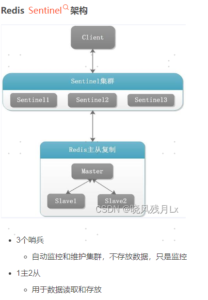
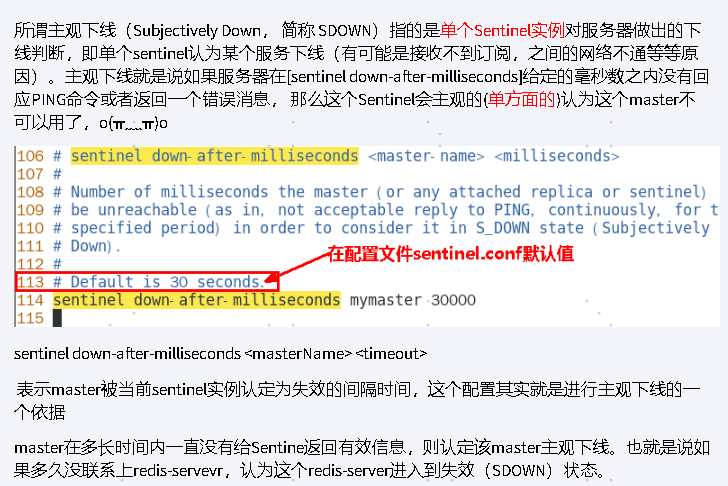
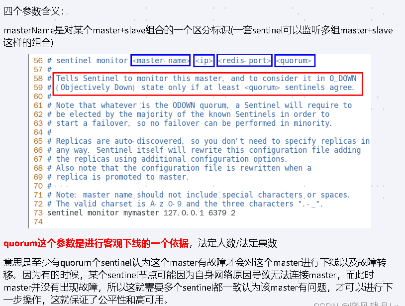
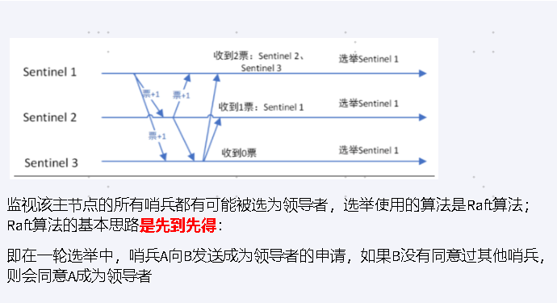

哨兵巡查监控后台master主机是否故障，

如果故障了根据投票数自动将某一个从库转换为新主库，继续对外服务，俗称无人值守运维

哨兵模式的作用
---

监控redis运行状态，包括master和slave

当master down机，能自动将slave切换成新master

哨兵的四个功能
---

主从监控

    监控主从redis库运行是否正常

消息通知

    哨兵可以将故障转移的结果发送到客户端

故障转移

    如果master异常，则会进行主从切换，将其中一个slave作为新master

配置中心

    客户端通过连接哨兵来获得当前Redis服务的主节点地址

哨兵运行流程和选举原理
---

当一个主从配置中的master失效之后，sentinel可以选举出一个新的master，

用于接替原master的工作，主从配置中其他redis服务器自动指向新的master同步数据。

一般建议sentinel采用奇数台，防止某一台sentinel无法连接到master导致误切换

SDOWN主观下线
---

SDOWN 是单个sentinel 自己主观上检测到的关于master的状态，

从sentinel的角度来看，如果发送了PING心跳后，在一定时间内没有收到合法的回复，就达到了SDOWN的条件

sentinel配置文件中的down-after-milliseconds 设置了判断主观下线的时间长度

ODOWN客观下线
---

ODOWN需要一定数量的sentinel，多个哨兵达成一致意见才能认为一个master客观上已经宕机

选举出领导者哨兵
---

当主节点被判断客观下线以后，各个哨兵节点会进行协商，县选举出一个领导者哨兵节点并由该领导者节点进行failover（故障迁移）

Raft算法 选出领导者节点

由领导者节点开始推动故障切换并选出一个新master

新主登基

    某个slave 备选成为新 master

群臣俯首

    一朝天子一朝臣，重新认老大

旧主拜服

    老master回来也得怂

以上的failover都是sentinel自己独立完成，完全无需人工干预

哨兵模式使用建议
---

哨兵节点的数量应为多个，哨兵本身应该集群，保证高可用

哨兵节点的数量应该是奇数个

各个哨兵节点的配置应该一致

如果哨兵节点部署在Docker等容器里，要注意端口的正确映射

哨兵集群+主从复制，并不能保证数据零丢失