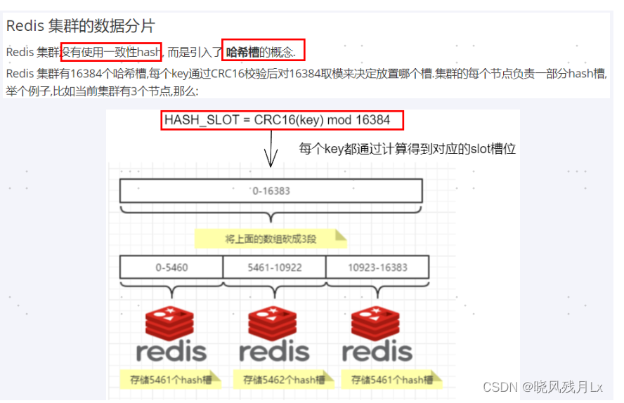
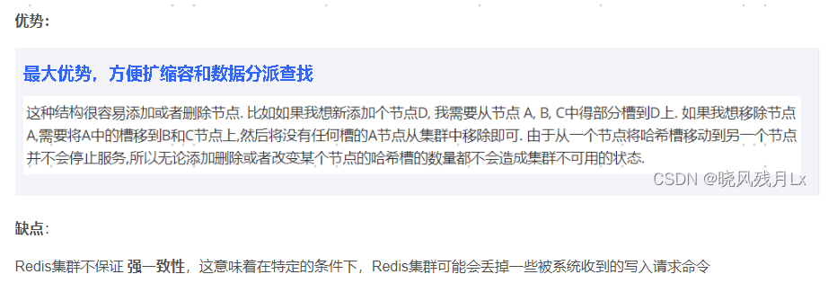

HASH_SLOT = CRC16(key) mod 16384
---

为什么redis集群的最大槽数是16384?
---

Redis集群并没有使用一致性hash而是引入了哈希槽的概念。

Redis 集群有16384个哈希槽，每个key通过CRC16校验后对16384取模来决定放置哪个槽，集群的每个节点负责一部分hash槽。

正常的心跳数据包带有节点的完整配置，可以用幂等方式用旧的节点替换旧节点，以便更新旧的配置。

这意味着它们包含原始节点的插槽配置，该节点使用2k的空间和16k的插槽，但是会使用8k的空间（使用65k的插槽）。

同时，由于其他设计折衷，Redis集群不太可能扩展到1000个以上的主节点。

因此16k处于正确的范围内，以确保每个主机具有足够的插槽，最多可容纳1000个矩阵，但数量足够少，可以轻松地将插槽配置作为原始位图传播。

请注意，在小型群集中，位图将难以压缩，因为当N较小时，位图将设置的slot / N位占设置位的很大百分比。

如果槽位为65536，发送心跳信息的消息头达8k，发送的心跳包过于庞大。**在消息头中最占空间的是myslots[CLUSTER_SLOTS/8]。 

当槽位为65536时，这块的大小是: 65536÷8÷1024=8kb

在消息头中最占空间的是myslots[CLUSTER_SLOTS/8]。 

当槽位为16384时，这块的大小是: 16384÷8÷1024=2kb

因为每秒钟，redis节点需要发送一定数量的ping消息作为心跳包，如果槽位为65536，这个ping消息的消息头太大了，浪费带宽。