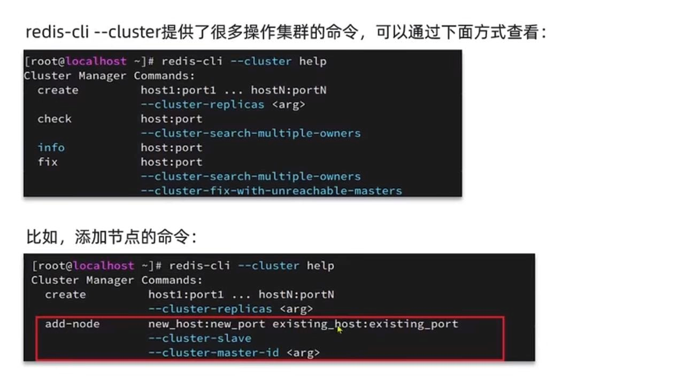
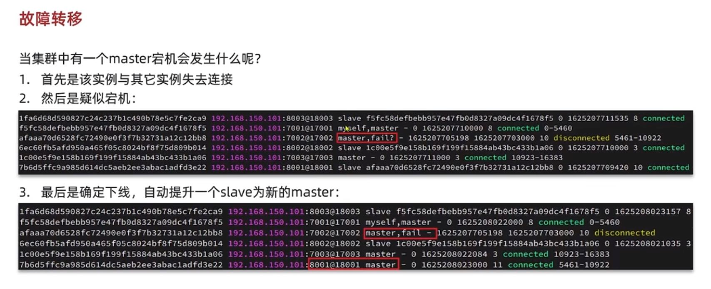
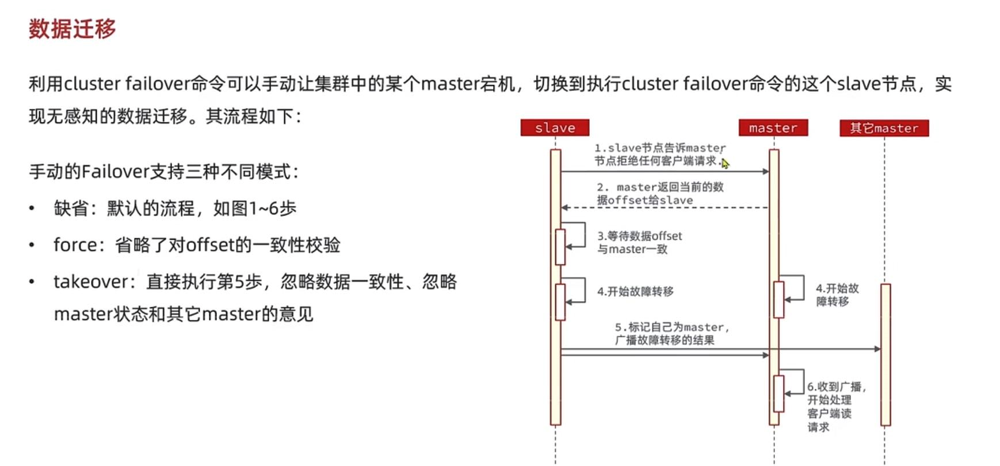

集群伸缩
---

添加节点到集群

    redis-cli --cluster add-node 新的IP:端口 集群已存在的IP:端口

删除节点

    cluster forget

    redis-cli --cluster del-node

故障转移
---

1、从所有的从节点里面选举出一个新的主节点；

2、选举出的新主会执行slaveof no one把自己的状态从slave变成master；

3、撤销已下线的主节点的槽指派，并把这些槽位重新指派给自己。

手动数据转移（手动主从替换）
---

使用cluster failover命令手动让集群某个master宕机 

切换到这个master对应的replica

master拒绝接受任何客户端请求

master返回当前的offset给replica

等待replica数据offset和master同步一致

replica标记自己为新的master  发送自己成为新的master广播消息给其他master

