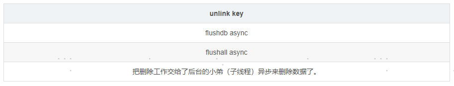

因为单线程有单线程的问题，比如我要删除一个比较大的key

del bigkey 会一直阻塞，等待删除完成，才能继续操作，会导致Redis主线程卡顿

所以引入了 惰性删除 可以有效避免Redis主线程卡顿

在 Redis 4.0 中就新增了多线程的模块，当然此版本中的多线程主要是为了解决删除数据效率比较低的问题的。

因为Redis是单个主线程处理，redis之父antirez一直强调"Lazy Redis is better Redis".

而lazy free的本质就是把某些cost(主要时间复制度，占用主线程cpu时间片)较高删除操作，

从redis主线程剥离让BIO子线程来处理，极大地减少主线阻塞时间。从而减少删除导致性能和稳定性问题。

虽然引入了多个线程来实现数据的异步惰性删除等功能，但其处理读写请求的仍然只有一个线程，所以仍然算是狭义上的单线程