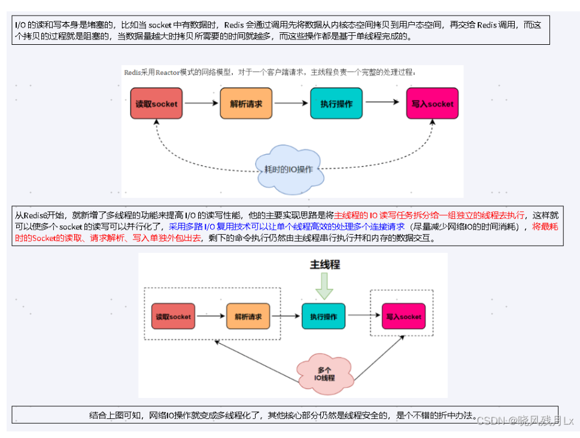
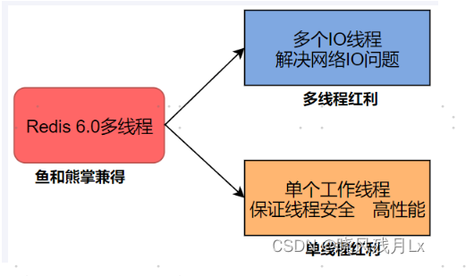

对于Redis 主要的性能瓶颈是内存或者网络带宽 而并非CPU
---
Redis的瓶颈初步定为 网络IO
---

在Redis6/7中，非常受关注的第一个新特性就是多线程。

这是因为，Redis一直被大家熟知的就是它的单线程架构，虽然有些命令操作可以用后台线程或子进程执行（比如数据删除、快照生成、AOF重写）。

但是，从网络IO处理到实际的读写命令处理，都是由单个线程完成的。

随着网络硬件的性能提升，Redis的性能瓶颈有时会出现在网络IO的处理上，也就是说，单个主线程处理网络请求的速度跟不上底层网络硬件的速度

`采用多个IO线程来处理网络请求，提高网络请求处理的并行度，Redis6/7就是采用的这种方法。`

但是，Redis的多IO线程只是用来处理网络请求的，对于读写操作命令Redis仍然使用单线程来处理。

这是因为，Redis处理请求时，网络处理经常是瓶颈，通过多个IO线程并行处理网络操作，可以提升实例的整体处理性能。

而继续使用单线程执行命令操作，就不用为了保证Lua脚本、事务的原子性，额外开发多线程互斥加锁机制了(不管加锁操作处理)，这样一来，Redis线程模型实现就简单了

`Redis 只是将 I/O 读写变成了多线程，而命令的执行依旧是由主线程串行执行的`

Redis6→7将网络数据读写、请求协议解析通过多个IO线程的来处理 ，对于真正的命令执行来说，仍然使用主线程操作
---

