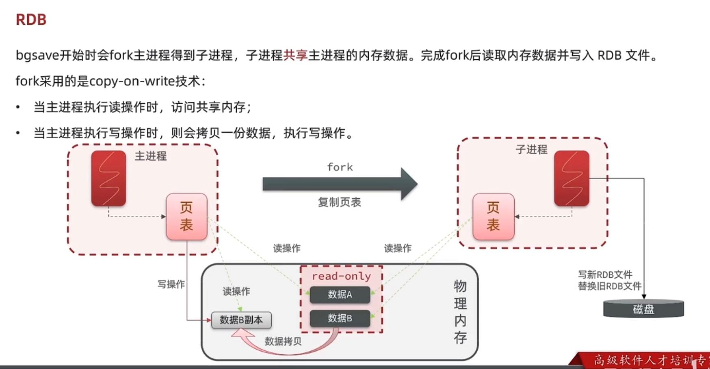

redis database backup file（数据备份文件）
---

redis数据备份文件 也叫 redis快照

redis -cli

save 主进程执行RDB，会阻塞所有命令

bgsave (background save) 开启子进程执行RDB 避免阻塞

redis在停机前会自动执行save

可以在redis.conf文件配置 

    #多少秒内有多个key被修改 执行 bgsave
    save 900 1
    save 300 10
    save 60 10000

    #开启压缩 默认开启
    rdbcompression yes

    #文件名
    dbfilename dump.rdb

    #保存路径
    dir ./

    

redis database backup file原理
---

fork主进程得到子进程（主进程阻塞），子进程共享主进程的内存数据

完成fork（结束主进程阻塞）后异步读取内存数据并写入RDB文件

---
在Linux中 ,应用系统无法直接操作物理内存,

redis主进程对内存数据的读写，使用的是系统给redis进程分配的虚拟内存

物理内存和虚拟内存的映射关系有page table（页表来维护）

---

执行fork的过程中会创建一个子进程（等同于当前进程的副本），

拷贝page table（页表，虚拟内存和物理内存的映射关系表）

就可以共享主进程的数据

接着子进程开始从内存中读取数据写新的RDB文件 替换掉旧的RDB文件

---

在读写并发的时候，如何解决并发导致的脏数据问题？
---

fork采用的是copy-on-write（写拷贝）的技术

    当主进程执行读操作，访问共享内存；

    当主进程执行写操作，则拷贝一份数据，在备份数据执行写操作。

但是这个写拷贝技术的问题在于一执行写操作，就要拷贝数据，造成内存资源紧张。

总结RDB
---
异步操作内存并保存数据

使用copy-on-write技术减少fork的开心

fork子进程，压缩，写出RDB文件耗时

