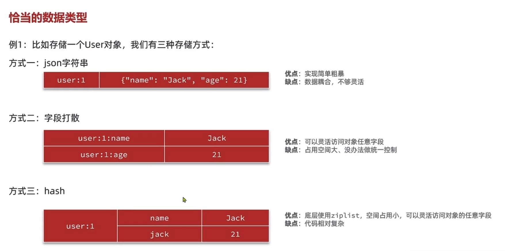

比如存储user对象，有三种存储方式

    1   json字符串， 冗余字段多，占存储空间 使用方便 序列化和反序列化方便

    2   字段打散，每个字段分开保存 灵活访问对象任意字段 缺点是占用空间大

    3   hash结构 底层使用ziplist 空间占用小 灵活访问任意字段 但是序列化反序列化时要编写代码

hash底层使用的是ziplist,但是hash的entry数量超过512个，

会使用hash表而不是ziplist 内存占用较多

可以通过hash-max-ziplist-entries配置entry上限，但是

entry过多会导致big key问题

hash什么情况下才用zip list?
---
同时满足 

    hash保存的所有键值的字符串长度小于64字节

    hash对象保存的键值对数量小于512个