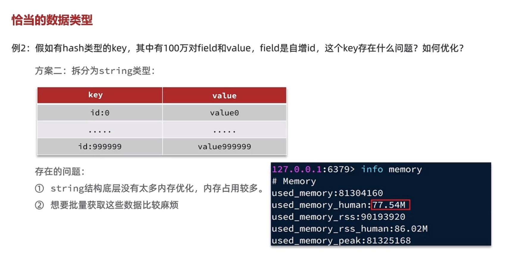
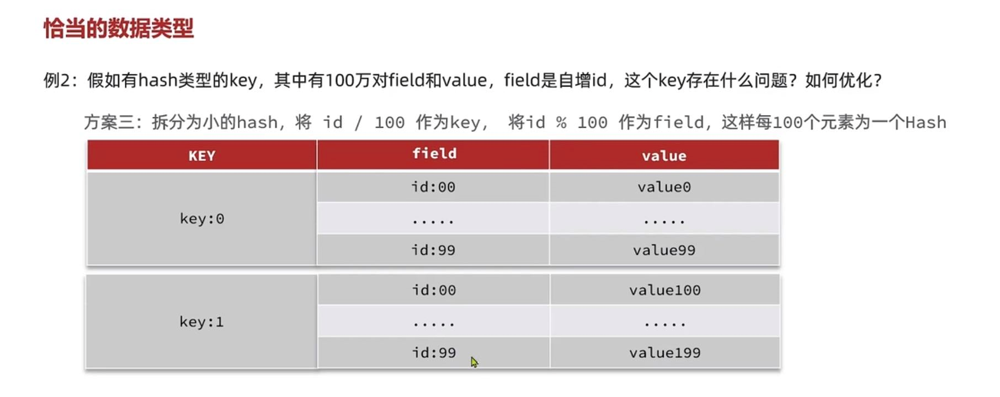
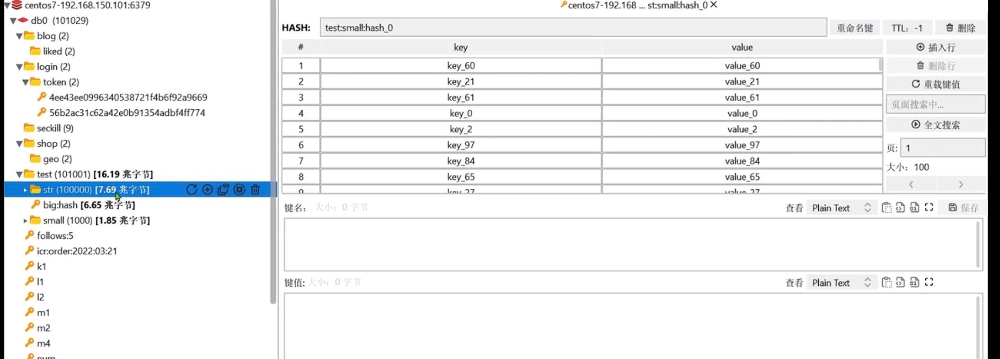
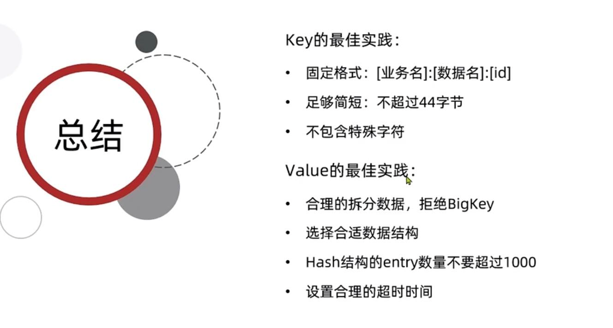

比如存储user对象，有三种存储方式

    1   json字符串， 冗余字段多，占存储空间 使用方便 序列化和反序列化方便

    2   字段打散，每个字段分开保存 灵活访问对象任意字段 缺点是占用空间大

    3   hash结构 底层使用ziplist 空间占用小 灵活访问任意字段 但是序列化反序列化时要编写代码

zip list的好处？
---
内存占用小，存储时内存分配是连续的，查询更快

拿list来说，实现有双向链表、zip list。但是双向链表有prev指针，和next指针，一个指针8字节，两个就16字节

但是在zip list中只有一个previous_entry_length保存了上一个entry的长度，如果上一个entry

的长度小于263字节，previous_entry_length只占一个字节，当entry的长度大于previous_entry_length时

才占用5个字节，并且zip list是连续内存空间，查询快，还可以压缩

zip list没有指针

hash什么情况下才用zip list?
---
同时满足

    hash保存的所有键值的字符串长度小于64字节

    hash对象保存的键值对数量小于512个

如果说hash的数据比较大怎么办？
---

1   通过config set调整redis中zip list中的entry上限
---

hash底层使用的是ziplist,但是hash的entry数量超过512个，

会使用hash表而不是ziplist 内存占用较多

可以通过hash-max-ziplist-entries配置entry上限，但是

entry过多会导致big key问题

2   使用string类型把hash中的一百万数据分别存储
---

如果把hash中的键值对 拿出来 使用string类型存储 100万个key-value 占用的内存 反而可以比hash结构占用的内存更大

而且想要批量获取这些数据比较麻烦

3   把大的hash拆分成小的hash 
---

将ID/100取商作为key，将ID%100取模作为field， 这样每一百个元素就为一个hash，

设置成500也可以，只要不超过512就可以

`String` 和 `big hash` 和 `hash分散小的hash` 的内存占用对比
---

7.68兆 > 6.65兆 > 1.85兆

key和value合理设置的总结
---

