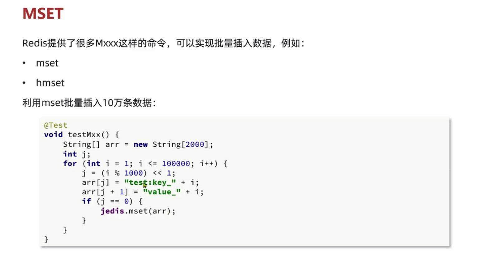
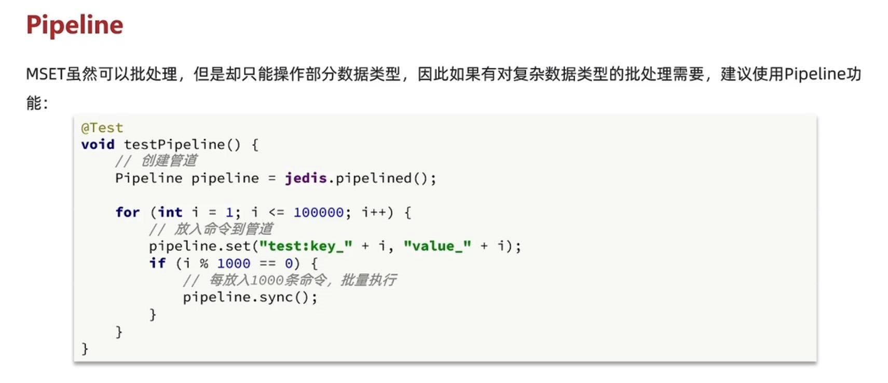

mset hset (具有原子性)
---

    MSET key1 "Hello" key2 "World"
        
    HMSET myhash field1 "Hello" field2 "World"

但是要记住 不要在一次批处理中传输太多命令，否则单次命令占用带宽过多，会导致网络阻塞。

string 类型的批处理 MSET

hash 类型的批处理 HSET 但是单次只有处理一个key

set 类型的批处理 SADD 但是单次只有处理一个key

对于复杂数据类型的批处理需要，建议使用pipeline功能(pipeline多个命令之间不具有原子性)
---

集群下的批处理
---

如果是mset hmset或者pipeline这种批处理 一次请求多个命令

如果redis是集群，那么批处理命令多个key必须落在以恶插槽，否则就会导致执行失败。

