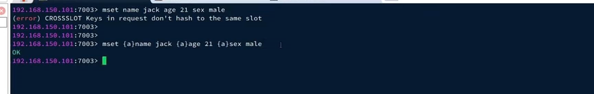
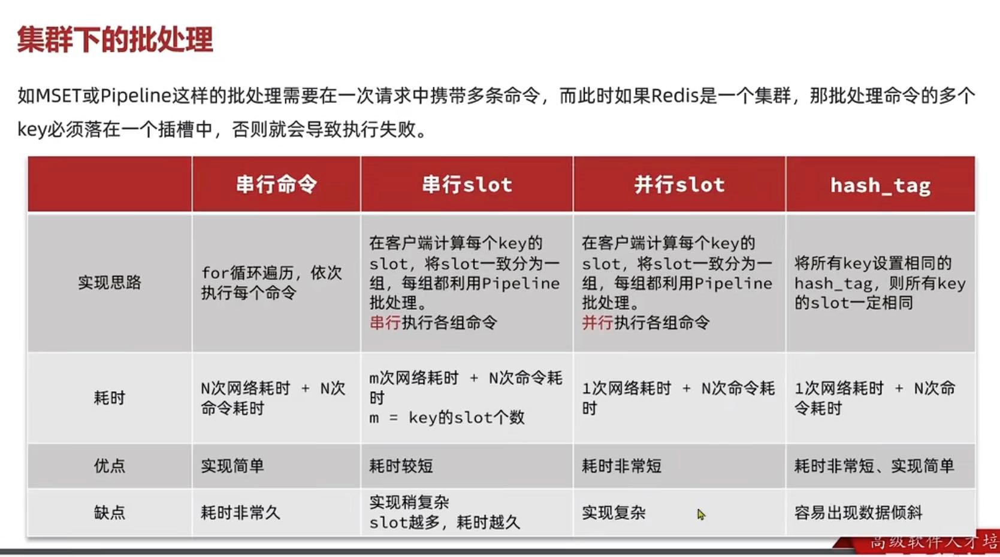

mset hset (具有原子性)
---

    MSET key1 "Hello" key2 "World"
        
    HMSET myhash field1 "Hello" field2 "World"

但是要记住 不要在一次批处理中传输太多命令，否则单次命令占用带宽过多，会导致网络阻塞。

string 类型的批处理 MSET

hash 类型的批处理 HSET 但是单次只有处理一个key

set 类型的批处理 SADD 但是单次只有处理一个key

对于复杂数据类型的批处理需要，建议使用pipeline功能(pipeline多个命令之间不具有原子性)
---

集群下的批处理
---

如果是mset hmset或者pipeline这种批处理 一次请求多个命令

如果redis是集群，那么批处理命令多个key必须落在同一个插槽，否则就会导致执行失败。

集群使用公式CRC16(key的有效值部分)%16384来计算key属于哪个槽

串行slot和并行slot
---

可以先计算每个key的对应的slot 把slot相同的分一组 每组利用pipeline执行批处理。 

多组pipeline可以使用串行也可以使用并行执行

hash tag
---

指定hash tag 也就是key的有效部分

将所有key设置相同hash_tag，这样所有的key的插槽slot一定相同

但是容易造成单个节点数据倾斜

各种集群批处理的对比图
---

lettuce
---

在spring redis template 内部 使用的 lettuce

lettuce中对mset的操作已经做了判断 如果是集群 会先计算key的插槽