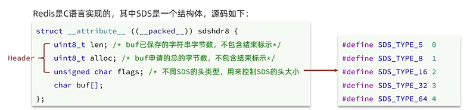
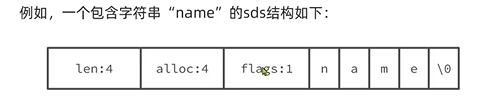
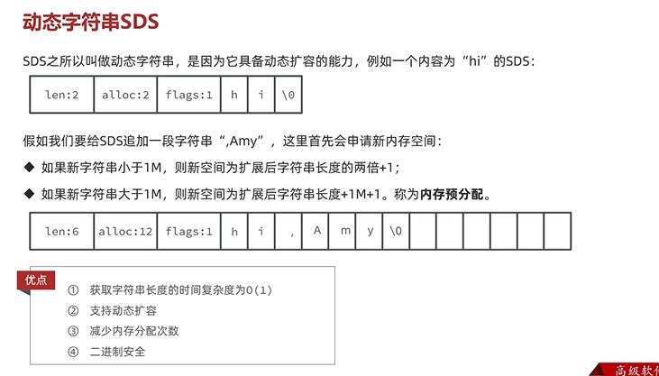

动态字符串simple dynamic string
---

redis是C语言实现的

SDS是一个结构体

保存的最大范围是255个字节

    len     已保存的字符串字节数
    alloc   申请的总的字节数
    flags   不同SDS的头类型

一个包含“name”的sds结构如下

SDS可以动态扩容

    如果新字符串小于1M 则新空间为扩展后字符串长度的两倍+1

    如果新字符串小于1M 则新空间为扩展后字符串长度+1M+1 称为预分配

优点
---

获取字符串长度的时间复杂度为O(1)

支持动态扩容

减少内存分配次数

二进制安全
 
