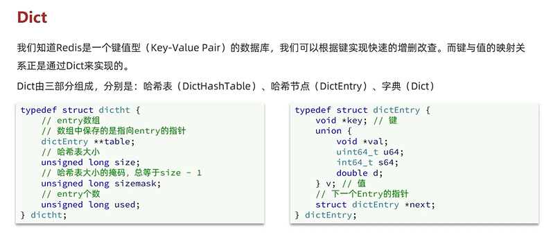
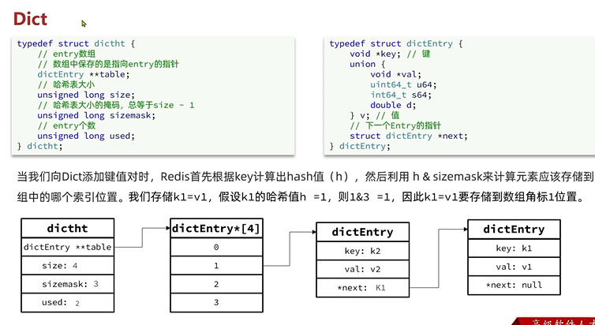
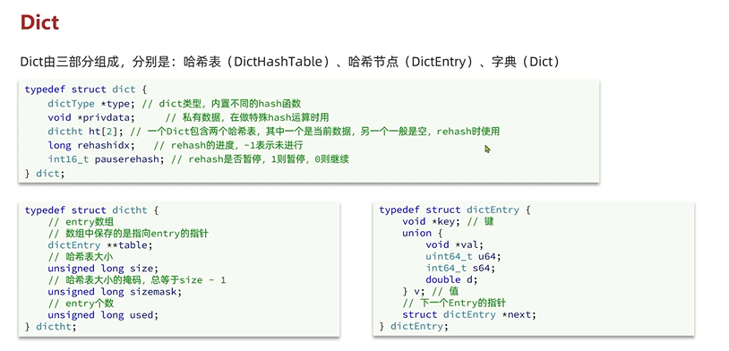
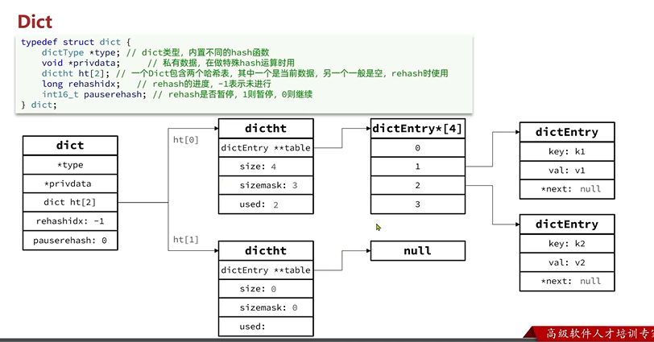
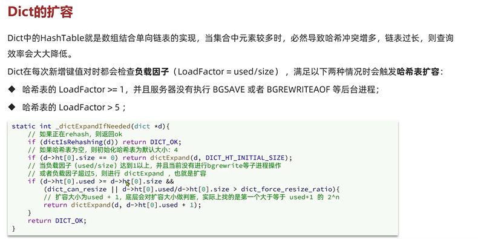
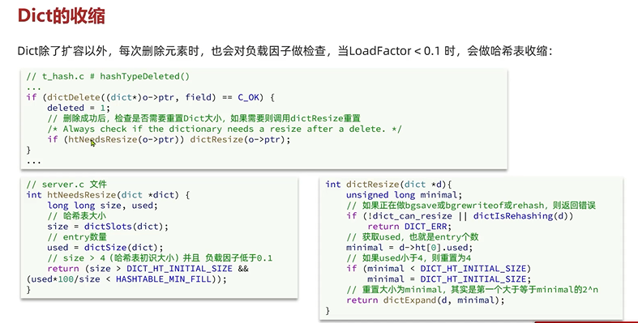

Dict
---

dict  dictionary 字典的缩写

键值的映射关系通过dict来实现的

dict由三个部分组成

    哈希表     dictHashTable

    哈希节点   dictEntry 

    字典      dict

如果hash冲突，使用头插法 新的entry的next指向旧的entry 

与运算 
    
    全1为1 有零为零

dict有两个哈希表，一个是当前数据，一个是空的 在做扩容的rehash使用 

dict的扩容
---

和Java的HashMap很相似

dict的收缩
---

 
dict的rehash
---
