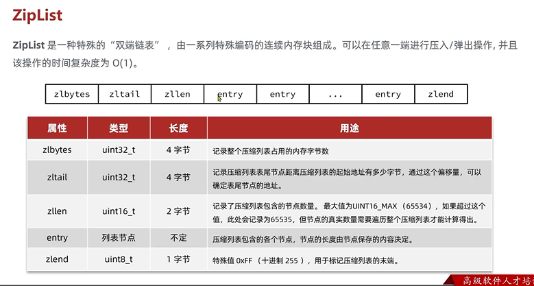
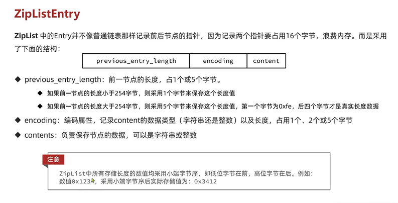
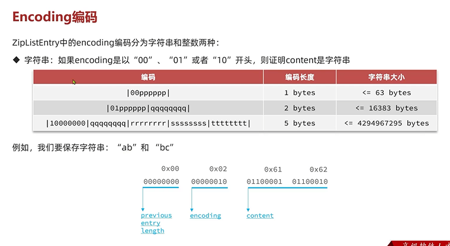
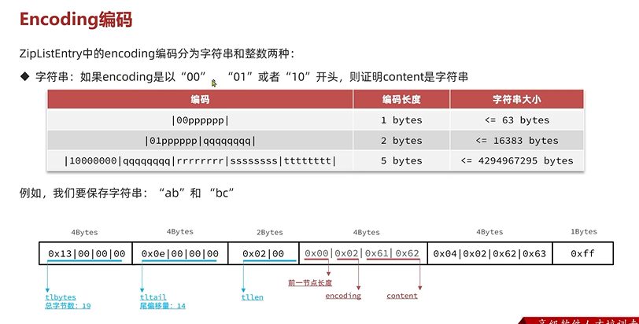
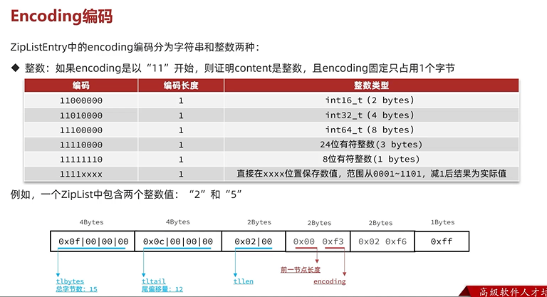

ZipList 压缩列表
---

`zlend` 结束标识 固定 0xff 转成十进制 255

十六进制每一个位就是2进制的4个bit位 

`zlend` 8个bit位 刚好1个字节

第一个`entry`一般称为`head` 最后一个entry一般称为`tail`

`zlbytes`标识这个`ziplist`占用的总字节数

`zltail`标识着尾偏移量 代表着从尾节点到起始地址之间的字节数 这样就能快速找到最后一个entry（tail）的数据

`zllen` 代表着entry节点个数

    zlbytes（四字节）,zltail（四字节）,zllen（四字节）这三个头信息
    
    和zlend（1字节）这一个尾信息 占用的字节数都是固定的

ZipListEntry
---

`entry`长度不固定

`previous_entry_length`  前一个节点长度 

    前一个节点长度小于254个字节 采用1个字节来保存这个长度值

    前一个节点长度大于254个字节 采用5个字节来保存这个长度值

`encoding`   编码属性  记录`content`内容的数据类型 （字符串还是整数）以及长度 占用一个 两个 五个字节

`content` 负责保存节点的数据 可以是字符串或者证书

因为encoding中有content的长度 所以 `previous_entry_length` 加 `encoding` 加 `content`  就等于下一个节点的地址

当前`Entry`的地址减去 `previous_entry_length`  前一个节点长度  就等于上一个entry的地址

encoding编码
---

字符串

整数

