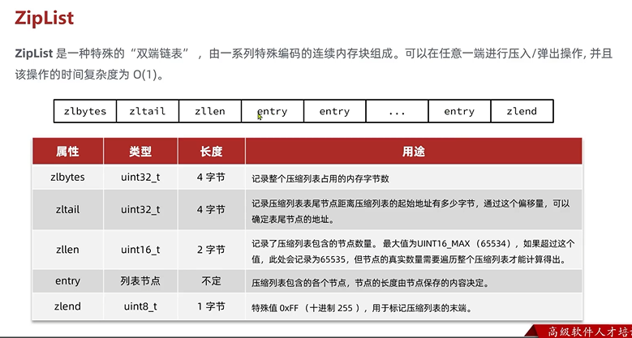
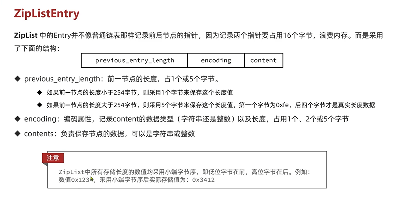
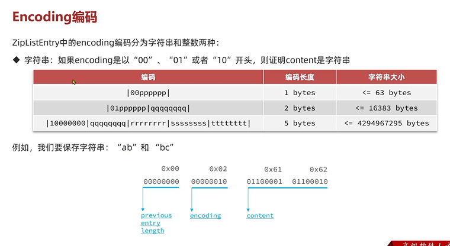
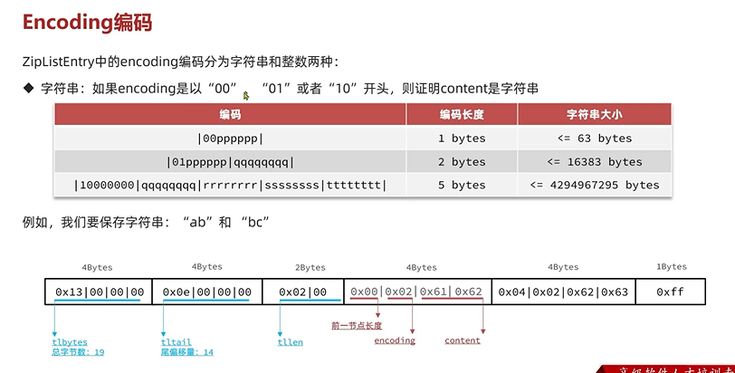
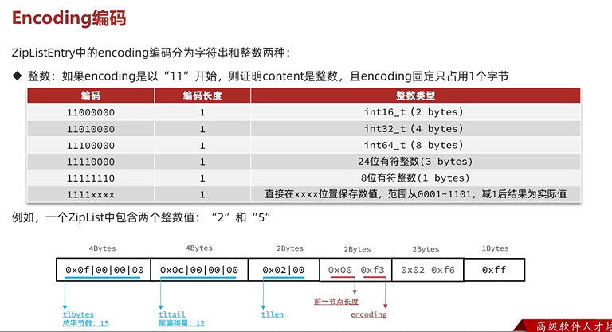
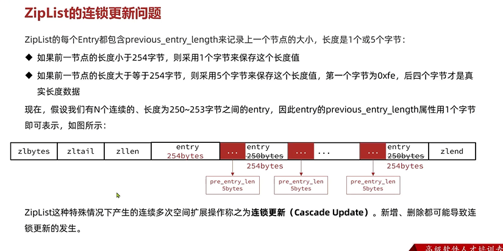

ZipList 压缩列表
---

`zlend` 结束标识 固定 0xff 转成十进制 255

十六进制每一个位就是2进制的4个bit位 

`zlend` 8个bit位 刚好1个字节

第一个`entry`一般称为`head` 最后一个entry一般称为`tail`

`zlbytes`标识这个`ziplist`占用的总字节数

`zltail`标识着尾偏移量 代表着从尾节点到起始地址之间的字节数 这样就能快速找到最后一个entry（tail）的数据

`zllen` 代表着entry节点个数

    zlbytes（四字节）,zltail（四字节）,zllen（四字节）这三个头信息
    
    和zlend（1字节）这一个尾信息 占用的字节数都是固定的

ZipListEntry
---

`entry`长度不固定

`previous_entry_length`  前一个节点长度 

    前一个节点长度小于254个字节 采用1个字节来保存这个长度值

    前一个节点长度大于等于254个字节 采用5个字节来保存这个长度值

`encoding`   编码属性  记录`content`内容的数据类型 （字符串还是整数）以及长度 占用一个 两个 五个字节

`content` 负责保存节点的数据 可以是字符串或者证书

因为encoding中有content的长度 所以 `previous_entry_length` 加 `encoding` 加 `content`  就等于下一个节点的地址

当前`Entry`的地址减去 `previous_entry_length`  前一个节点长度  就等于上一个entry的地址

encoding编码
---

字符串

整数

连锁更新问题
---

`previous_entry_length`  前一个节点长度 1个字节 变成 5个字节导致的连锁更新

几个连续的entry 都是在250个字节 当第一个entry长度变化 超过254  第二个entry记录前一个节点

长度就需要5个字节 第二个entry就变成了254 接着后面如果是类似的 就会发生连锁更新问题

总结
---

ListPack
---
listpack的出现并不能解决链表中频繁插入和删除造成的重新申请空间和复制数据的问题,主要为了解决级联更新的问题,