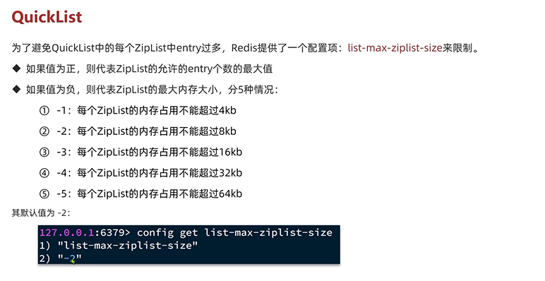
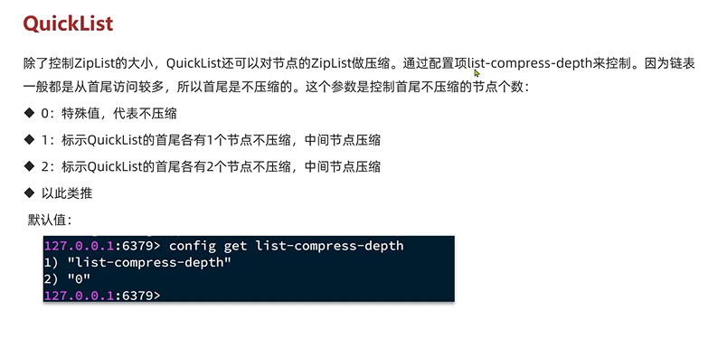
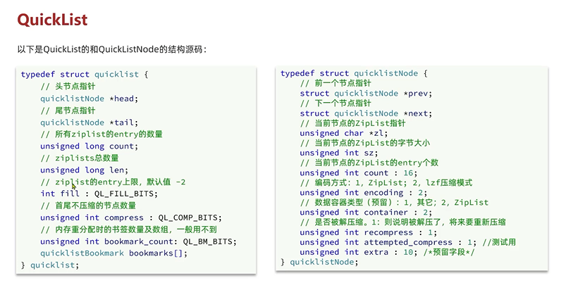
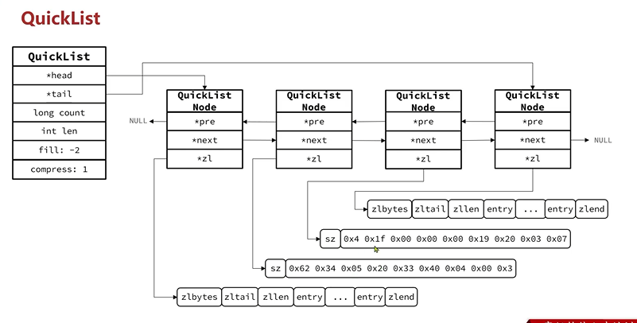
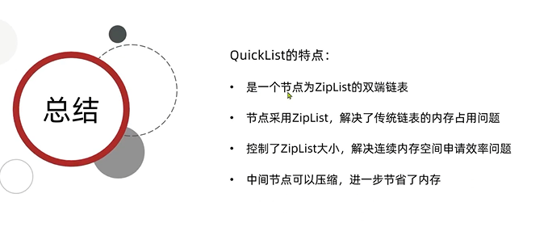

QuickList
---

因为 zip list 需要申请连续空间，但内存占用较多，申请内存效率低

且 连续空间导致内存碎片

如果要存储大量数据 超出了zip list的最佳上限

就得创建多个zip list 来分片管理数据

多个zip list通过一个叫 `quick list`来做关联

quick list 是一个双端链表 链表中的每一个节点都是一个zip list

配置 list-max-ziplist-size来限制 zip list

    当该配置值为正数 代表zip list的允许的entry个数的最大值

    如果值为负 代表zip list的最大内存大小 默认-2 每个zip list内存占用不能超过8KB

对节点中的zip list进行压缩
---

quick list 结构
---

总结
---

