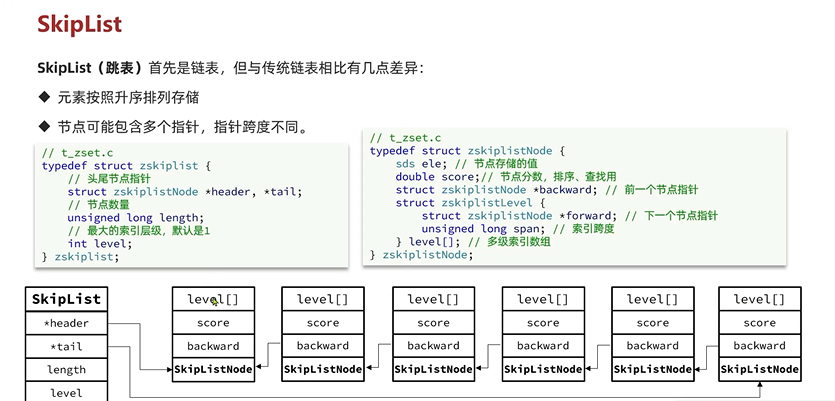
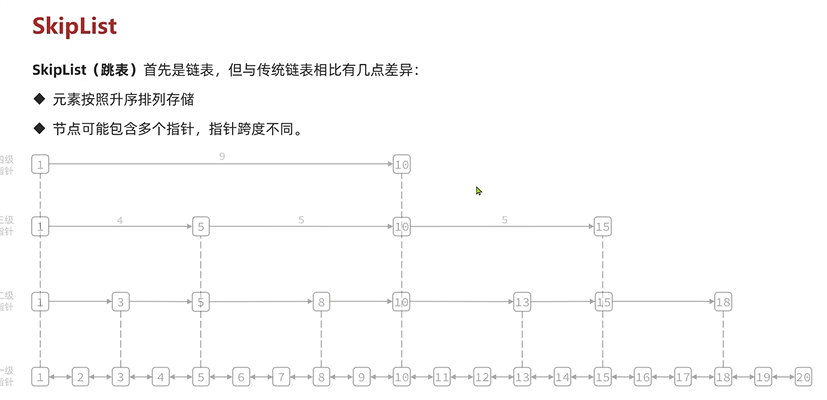
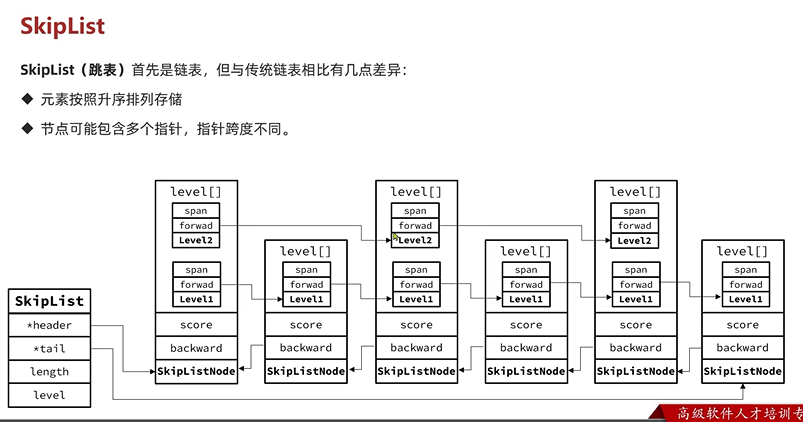
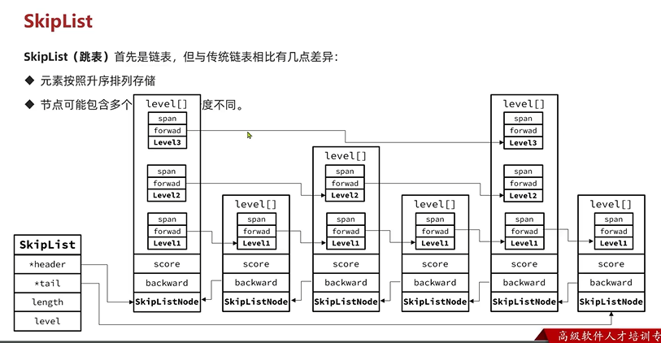
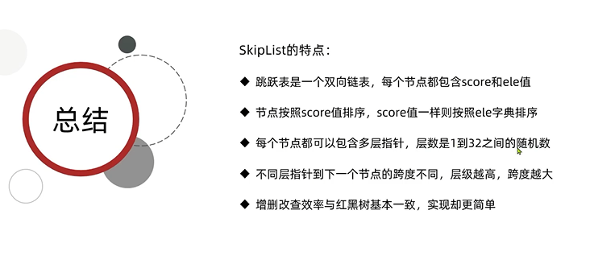

Skip List
---

对于从首尾开始查询的话 zip list非常适合，但是需要从中间查询的话

skip list更适合

SkipList 中的level代表索引层级 链表越长层级越多 这个level 越高

SkipListNode中的level则是一个数据 存放多级索引 比如上图的1 就有4级指针

SkipListNodeLevel中的span索引跨度 代表这个指针跨越多少个元素

score 得分 做排序用

每个节点可以包含多层指针，层数是1到32之间的随机数

总结
---

